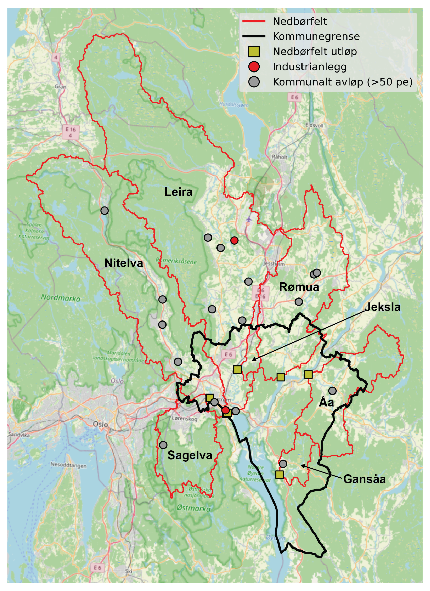

# TEOTIL3 Lillestrøm

Using monitoring and modelling to assess water quality in catchments draining to Lillestrøm kommune.

## 1. Scope

This project aims to:

 * Summarise available monitoring data for catchments around Lillestrøm kommune.
   
 * Describe present-day water quality status and observed trends over time.

 * Use modelling to identify the main sources of nutrients in each catchment.

 * Describe the potential for reducing nutrient loads in each catchment using measures targeting wastewater and agriculture (based on recent modelling of the Oslofjord catchment undertaken by NIVA for Miljødirekotratet).

## 2. Area of interest

The table and map below show the catchments of interest.

| Catchment ID |   Name  | Outlet lon | Outlet lat |                            Comment                           |
|:------------:|:-------:|:----------:|:----------:|:------------------------------------------------------------:|
|       1      | Sagelva |  11.02384  |  59.95745  |                     Tributary to Nitelva                     |
|       2      | Nitelva |  11.07092  |  59.93806  |            Just upstream of confluence with Leira            |
|       3      |  Leira  |  11.07367  |  59.93905  |           Just upstream of confluence with Nitelva           |
|       4      |  Rømua  |  11.20984  |  59.99055  |                    Single REGINE; no lakes                   |
|       5      |  Jeksla |  11.09281  |  59.99753  | Small sub-catchment of Leira; not resolved by REGINE network |
|       6      |    Åa   |  11.28279  |  59.99649  |                   Single REGINE; few lakes                   |
|       7      |  Gansåa |  11.22130  |  59.86080  |                Not resolved by REGINE network                |

   
  <em>Lillestrøm kommune (black outline) and the seven catchments considered in this analysis (red outlines). Yellow squares mark catchment outlets; red circles are point source discharges from industry; grey circles are discharges from municipal wastewater plants (with capacity >50 pe).</em>

## 3. Sources of nutrients

### 3.1. Diffuse sources

The map and table below show land cover proportions for each catchment.

 * Forest is the dominant land cover (≥65 %) for Leira, Nitelva, Sagelva, Åa and Gansåa.
   
 * Agriculture is the dominant land cover class for Rømua (49 %) and Jeksla (39 %), and also covers significant parts of Leira (20 %) and Åa (23 %).

 * Sagelva and Jeksla have significant urban areas (16 % and 23 %, respectively).

   
  <em>Land cover based on the ‘ARTYPE’ classifications from NIBIO’s AR50 dataset.</em>

<table border="1" cellspacing="0" cellpadding="6">
  <thead>
    <tr>
      <th rowspan="2" style="text-align:center;">AR50 klasse</th>
      <th colspan="2">Leira</th>
      <th colspan="2">Nitelva</th>
      <th colspan="2">Sagelva</th>
      <th colspan="2">Rømua</th>
      <th colspan="2">Åa</th>
      <th colspan="2">Gansåa</th>
      <th colspan="2">Jeksla</th>
    </tr>
    <tr>
      <th>km²</th><th>%</th>
      <th>km²</th><th>%</th>
      <th>km²</th><th>%</th>
      <th>km²</th><th>%</th>
      <th>km²</th><th>%</th>
      <th>km²</th><th>%</th>
      <th>km²</th><th>%</th>
    </tr>
  </thead>
  <tbody>
    <tr>
      <td style="text-align:center;">Bebygd</td>
      <td style="text-align:right;">46.5</td><td style="text-align:right;">7</td>
      <td style="text-align:right;">45.3</td><td style="text-align:right;">9</td>
      <td style="text-align:right;">17.6</td><td style="text-align:right;">16</td>
      <td style="text-align:right;">9.8</td><td style="text-align:right;">5</td>
      <td style="text-align:right;">2.0</td><td style="text-align:right;">2</td>
      <td style="text-align:right;">0.8</td><td style="text-align:right;">3</td>
      <td style="text-align:right;">3.8</td><td style="text-align:right;">23</td>
    </tr>
    <tr>
      <td style="text-align:center;">Jordbruk</td>
      <td style="text-align:right;">132.0</td><td style="text-align:right;">20</td>
      <td style="text-align:right;">36.1</td><td style="text-align:right;">8</td>
      <td style="text-align:right;">6.8</td><td style="text-align:right;">6</td>
      <td style="text-align:right;">103.3</td><td style="text-align:right;">49</td>
      <td style="text-align:right;">29.6</td><td style="text-align:right;">23</td>
      <td style="text-align:right;">3.4</td><td style="text-align:right;">13</td>
      <td style="text-align:right;">6.6</td><td style="text-align:right;">39</td>
    </tr>
    <tr>
      <td style="text-align:center;">Skog</td>
      <td style="text-align:right;">436.0</td><td style="text-align:right;">65</td>
      <td style="text-align:right;">363.9</td><td style="text-align:right;">75</td>
      <td style="text-align:right;">77.0</td><td style="text-align:right;">71</td>
      <td style="text-align:right;">92.9</td><td style="text-align:right;">44</td>
      <td style="text-align:right;">93.8</td><td style="text-align:right;">72</td>
      <td style="text-align:right;">18.6</td><td style="text-align:right;">73</td>
      <td style="text-align:right;">6.5</td><td style="text-align:right;">38</td>
    </tr>
    <tr>
      <td style="text-align:center;">Snaumark</td>
      <td style="text-align:right;">2.2</td><td style="text-align:right;">0</td>
      <td style="text-align:right;">3.8</td><td style="text-align:right;">1</td>
      <td style="text-align:right;">1.2</td><td style="text-align:right;">1</td>
      <td style="text-align:right;">1.2</td><td style="text-align:right;">1</td>
      <td style="text-align:right;">0.0</td><td style="text-align:right;">0</td>
      <td style="text-align:right;">0.1</td><td style="text-align:right;">0</td>
      <td style="text-align:right;">0.1</td><td style="text-align:right;">1</td>
    </tr>
    <tr>
      <td style="text-align:center;">Myr</td>
      <td style="text-align:right;">27.6</td><td style="text-align:right;">4</td>
      <td style="text-align:right;">9.1</td><td style="text-align:right;">2</td>
      <td style="text-align:right;">0.7</td><td style="text-align:right;">1</td>
      <td style="text-align:right;">4.1</td><td style="text-align:right;">2</td>
      <td style="text-align:right;">3.0</td><td style="text-align:right;">2</td>
      <td style="text-align:right;">1.8</td><td style="text-align:right;">7</td>
      <td style="text-align:right;">0.0</td><td style="text-align:right;">0</td>
    </tr>
    <tr>
      <td style="text-align:center;">Ferskvann</td>
      <td style="text-align:right;">23.8</td><td style="text-align:right;">4</td>
      <td style="text-align:right;">25.7</td><td style="text-align:right;">5</td>
      <td style="text-align:right;">5.6</td><td style="text-align:right;">5</td>
      <td style="text-align:right;">0.5</td><td style="text-align:right;">0</td>
      <td style="text-align:right;">2.3</td><td style="text-align:right;">2</td>
      <td style="text-align:right;">0.7</td><td style="text-align:right;">3</td>
      <td style="text-align:right;">0.0</td><td style="text-align:right;">0</td>
    </tr>
    <tr style="font-weight:bold;">
      <td style="text-align:center;">Totalt</td>
      <td style="text-align:right;">668.1</td><td style="text-align:right;">100</td>
      <td style="text-align:right;">483.9</td><td style="text-align:right;">100</td>
      <td style="text-align:right;">108.9</td><td style="text-align:right;">100</td>
      <td style="text-align:right;">211.8</td><td style="text-align:right;">100</td>
      <td style="text-align:right;">130.7</td><td style="text-align:right;">100</td>
      <td style="text-align:right;">25.4</td><td style="text-align:right;">100</td>
      <td style="text-align:right;">17.0</td><td style="text-align:right;">100</td>
    </tr>
  </tbody>
</table>

### 3.2. Point sources

Major point sources are shown in the table below.

 * The largest single point source is **Nedre Romerike avløpsanlegg (NRA)**, which discharges to Nitelva just upstream of the confluence with Leira. Other significant wastewater discharges to Nitelva are renseanleggene at **Rotnes** and **Åneby**, further upstream. In Leira, significant wastewater discharges include **Gardermoen sentralrenseanlegg** and **Kløfta renseanlegg**, both in the lower-central part of the catchment.
   
 * The largest industrial point source is **Dynea Lillestrøm**, a manufacturer of adhesives and industrial coatings.

<table border="1" cellspacing="0" cellpadding="6">
  <thead>
    <tr>
      <th style="text-align:center;">Nedbørfelt</th>
      <th>Navn</th>
      <th>Sektor</th>
      <th>Type</th>
      <th style="text-align:right;">TOTN</th>
      <th style="text-align:right;">TOTP</th>
      <th style="text-align:right;">TOC</th>
      <th style="text-align:right;">SS</th>
    </tr>
  </thead>
  <tbody>
    <tr>
      <td style="text-align:center;">Sagelva</td>
      <td>Mariholtet sportsstue, renseanlegg</td>
      <td>Avløp</td>
      <td>Naturbasert</td>
      <td style="text-align:right;">0.01</td>
      <td style="text-align:right;">0.00</td>
      <td style="text-align:right;">0.01</td>
      <td style="text-align:right;">0.01</td>
    </tr>
    <tr>
      <td style="text-align:center;">Nitelva</td>
      <td>Dynea Lillestrøm</td>
      <td>Industri</td>
      <td>Kjemisk industri</td>
      <td style="text-align:right;">27.89</td>
      <td style="text-align:right;">0.12</td>
      <td style="text-align:right;">18.13</td>
      <td style="text-align:right;">5.99</td>
    </tr>
    <tr>
      <td style="text-align:center;">Nitelva</td>
      <td>NRA (Nedre Romerike avløpsanlegg)</td>
      <td>Avløp</td>
      <td>Kjemisk-biologisk m/N-fjerning</td>
      <td style="text-align:right;">180.39</td>
      <td style="text-align:right;">5.21</td>
      <td style="text-align:right;">218.70</td>
      <td style="text-align:right;">154.27</td>
    </tr>
    <tr>
      <td style="text-align:center;">Nitelva</td>
      <td>Rotnes renseanlegg</td>
      <td>Avløp</td>
      <td>Kjemisk</td>
      <td style="text-align:right;">24.59</td>
      <td style="text-align:right;">0.39</td>
      <td style="text-align:right;">20.76</td>
      <td style="text-align:right;">16.04</td>
    </tr>
    <tr>
      <td style="text-align:center;">Nitelva</td>
      <td>Slattum renseanlegg (Nedlagt)</td>
      <td>Avløp</td>
      <td>Kjemisk</td>
      <td style="text-align:right;">25.25</td>
      <td style="text-align:right;">0.42</td>
      <td style="text-align:right;">54.56</td>
      <td style="text-align:right;">30.44</td>
    </tr>
    <tr>
      <td style="text-align:center;">Nitelva</td>
      <td>Åneby renseanlegg</td>
      <td>Avløp</td>
      <td>Kjemisk</td>
      <td style="text-align:right;">18.14</td>
      <td style="text-align:right;">0.15</td>
      <td style="text-align:right;">12.47</td>
      <td style="text-align:right;">6.73</td>
    </tr>
    <tr>
      <td style="text-align:center;">Nitelva</td>
      <td>Harestua renseanlegg</td>
      <td>Avløp</td>
      <td>Kjemisk-biologisk</td>
      <td style="text-align:right;">11.39</td>
      <td style="text-align:right;">0.13</td>
      <td style="text-align:right;">6.50</td>
      <td style="text-align:right;">12.45</td>
    </tr>
    <tr>
      <td style="text-align:center;">Leira</td>
      <td>Tuen renseanlegg (Nedlagt)</td>
      <td>Avløp</td>
      <td>Kjemisk</td>
      <td style="text-align:right;">0.01</td>
      <td style="text-align:right;">0.00</td>
      <td style="text-align:right;">0.01</td>
      <td style="text-align:right;">0.01</td>
    </tr>
    <tr>
      <td style="text-align:center;">Leira</td>
      <td>Kløfta renseanlegg</td>
      <td>Avløp</td>
      <td>Kjemisk</td>
      <td style="text-align:right;">36.32</td>
      <td style="text-align:right;">0.18</td>
      <td style="text-align:right;">38.07</td>
      <td style="text-align:right;">15.61</td>
    </tr>
    <tr>
      <td style="text-align:center;">Leira</td>
      <td>Avinor avd. Oslo Lufthavn Gardermoen</td>
      <td>Industri</td>
      <td>Flyplass</td>
      <td style="text-align:right;">0.00</td>
      <td style="text-align:right;">0.00</td>
      <td style="text-align:right;">1.27</td>
      <td style="text-align:right;">0.00</td>
    </tr>
    <tr>
      <td style="text-align:center;">Leira</td>
      <td>Gardermoen sentralrenseanlegg</td>
      <td>Avløp</td>
      <td>Kjemisk-biologisk m/N-fjerning</td>
      <td style="text-align:right;">48.34</td>
      <td style="text-align:right;">1.03</td>
      <td style="text-align:right;">36.47</td>
      <td style="text-align:right;">46.68</td>
    </tr>
    <tr>
      <td style="text-align:center;">Leira</td>
      <td>Gjerdrum renseanlegg (Nedlagt)</td>
      <td>Avløp</td>
      <td>Kjemisk</td>
      <td style="text-align:right;">17.72</td>
      <td style="text-align:right;">0.07</td>
      <td style="text-align:right;">14.74</td>
      <td style="text-align:right;">12.15</td>
    </tr>
    <tr>
      <td style="text-align:center;">Leira</td>
      <td>Åsgreina renseanlegg (Nedlagt)</td>
      <td>Avløp</td>
      <td>Kjemisk</td>
      <td style="text-align:right;">1.58</td>
      <td style="text-align:right;">0.02</td>
      <td style="text-align:right;">1.61</td>
      <td style="text-align:right;">1.41</td>
    </tr>
    <tr>
      <td style="text-align:center;">Leira</td>
      <td>Fagerli renseanlegg</td>
      <td>Avløp</td>
      <td>Biologisk</td>
      <td style="text-align:right;">0.36</td>
      <td style="text-align:right;">0.04</td>
      <td style="text-align:right;">0.27</td>
      <td style="text-align:right;">0.38</td>
    </tr>
    <tr>
      <td style="text-align:center;">Rømua</td>
      <td>Onsrud leir renseanlegg</td>
      <td>Avløp</td>
      <td>Kjemisk-biologisk</td>
      <td style="text-align:right;">0.18</td>
      <td style="text-align:right;">0.00</td>
      <td style="text-align:right;">0.00</td>
      <td style="text-align:right;">0.14</td>
    </tr>
    <tr>
      <td style="text-align:center;">Rømua</td>
      <td>Onsrud rekkehus</td>
      <td>Avløp</td>
      <td>Kjemisk-biologisk</td>
      <td style="text-align:right;">0.12</td>
      <td style="text-align:right;">0.00</td>
      <td style="text-align:right;">0.06</td>
      <td style="text-align:right;">0.10</td>
    </tr>
    <tr>
      <td style="text-align:center;">Rømua</td>
      <td>Ingjersmyr avløpsanlegg</td>
      <td>Avløp</td>
      <td>Kjemisk-biologisk</td>
      <td style="text-align:right;">0.12</td>
      <td style="text-align:right;">0.00</td>
      <td style="text-align:right;">0.04</td>
      <td style="text-align:right;">0.09</td>
    </tr>
    <tr>
      <td style="text-align:center;">Åa</td>
      <td>Hogset renseanlegg (Nedlagt)</td>
      <td>Avløp</td>
      <td>Kjemisk-biologisk</td>
      <td style="text-align:right;">3.13</td>
      <td style="text-align:right;">0.02</td>
      <td style="text-align:right;">1.03</td>
      <td style="text-align:right;">1.66</td>
    </tr>
    <tr>
      <td style="text-align:center;">Gansåa</td>
      <td>Dalen renseanlegg</td>
      <td>Avløp</td>
      <td>Kjemisk</td>
      <td style="text-align:right;">3.07</td>
      <td style="text-align:right;">0.03</td>
      <td style="text-align:right;">1.41</td>
      <td style="text-align:right;">2.46</td>
    </tr>
  </tbody>
</table>

## 4. Workflow

### 4.1 Task 1: Download monitoring data

From the proposal:

> Relevante overvåkingsdata for nedbørfeltene vil bli lastet ned fra Vannmiljø og koblet til informasjon om vannkvalitetstilstand hentet fra Vann-Nett. Datasettene vil bli standardisert og kvalitetssjekket (f.eks. for å fjerne ekstreme avvik).
>
> Lillestrøm kommune vil gi veiledning om de beste overvåkingsstasjonene/tidsseriene for sine nedbørfelt. Overvåkingsdata som ikke allerede er tilgjengelige via Vannmiljø kan også leveres av kommunen, om ønskelig (f.eks. ved bruk av en standard Excel-mal).

 * **Notebook 02** ([here](./code/02_vannmiljo_vann-nett_nve.ipynb)) downloads relevant data from Vannmiljø, Vann-Nett and NVE.
   
 * Monitoring stations suggested by Lillestrøm kommune are in the Excel file [here](./data/lillestrom_monitoring_sites.xlsx).

### 4.2. Task 2: Monitored nutrient inputs

From the proposal:

> Årlig næringsstofftilførsler i hvert nedbørfelt vil bli estimert ved å kombinere målte kjemiske konsentrasjoner (Oppgave 1) med vannføringsdata fra NVE.
> 
> Der kjemiske målestasjoner er i nærheten av NVE-stasjoner, vil vannføringsdata lastes ned via NVEs HydAPI og skaleres for å matche nedbørfeltet til den kjemiske målestasjonen. Der vannføringsovervåking ikke er tilgjengelig, vil vannføring bli estimert ved hjelp av modellresultater fra NVEs GTS API (med kvalitetskontroll mot observerte data, der det er mulig).
> 
> Årlig næringsstofftilførsler vil bli beregnet fra målte konsentrasjoner og daglig vannføring ved hjelp av den robuste OSPAR-metodikken (samme metoden som brukes for årlig rapportering til OSPAR og innenfor f.eks. Elveovervåkingsprogrammet).

 * **Notebook 02** ([here](./code/02_vannmiljo_vann-nett_nve.ipynb)) compares NVE's measured data for Sagelva to simulated discharge obtained from the GTS API.

 * **Notebook 03** ([here](./code/03_annual_concs.ipynb)) quality checks the Vannmiljø data by removing large outliers, then calculates annual mean concentrations for years with at least 12 samples per year. The Mann-Kendall and Sen's slope tests are used to investigate **trends in concentration**.

 * **Notebook 04** ([here](./code/04_annual_loads.ipynb)) estimates annual loads from the cleaned concentration data using the OSPAR method. The Mann-Kendall and Sen's slope tests are used to investigate **trends in annual loads**.

### 4.3. Task 3: Customise TEOTIL3 to use local datasets

From the proposal:

> Lillestrøm kommune vil levere data som beskriver (i) regnvann- og nød-overløp fra avløpsnettet, og (ii) utslipp fra private avløpsrenseanlegg. Data vil bli levert for så mange år og parametere som mulig.
> 
> Datasettene vil bli renset og utvidet til å inkludere alle hovedparameterne som er relevante for TEOTIL3 (TOTN, TOTP, TOC og SS). Hull i tidsseriene vil bli fylt ved interpolasjon og, om mulig, ekstrapolert til å dekke perioden fra 2013 til 2023.
> 
> For regine-enheter i Lillestrøm kommune vil det rensede datasettet som beskriver regnvann- og nød-overløp bli brukt til å forbedre de enkle, fast-prosent overløpsestimatene som ble antatt under Oslofjordprosjektet. Tilsvarende vil de detaljerte dataene for private avløpsrenseanlegg erstatte standard TEOTIL3-estimatene for utslipp fra «spredt avløp» (som er basert på aggregerte data).

 * **Not yet done.**

### 4.4. Task 4: Source-apportioned nutrient inputs from TEOTIL3

From the proposal:

> For nedbørfeltene i Tabell 1 vil årlige næringsstofftilførselen simulert av TEOTIL3 fra 2013 til 2023 bli sammenlignet med estimater basert på overvåkingsdata (Oppgave 2). Modellens ytelse vil bli evaluert, og viktige usikkerheter og begrensninger vil bli diskutert. Der modellens ytelse er tilstrekkelig, vil TEOTIL3 bli brukt til å gi en oversikt over de viktigste næringsstoffkildene i hvert nedbørfelt (naturlig, avløpsrensing, jordbruk osv.).
> 
> I tillegg vil det bli levert et datasett som viser kildefordelte tilførsler til hver regine-enhet i Lillestrøm kommune i henhold til TEOTIL3. Merk at dette datasettet vil være basert på modellinndata (dvs. før transport, akkumulering og retensjon i det hydrologiske nettverket) og inneholder betydelig usikkerhet på regine-skala.
> 
> Viktige punktkilder til næringsstoffer fra avløps- og industri-anlegg i hvert nedbørfelt vil bli identifisert ved hjelp av TEOTIL3-databasen (Figur 1). For avløpsanlegg vil typiske renseeffekter bli beregnet basert på historiske inn- og ut-strømninger rapportert til Miljødirektoratet via ALTINN. Dagens effektivitet vil bli diskutert i sammenheng med nye krav i det oppdaterte avløpsdirektivet og scenariene som er vurdert i det nylig gjennomførte modelleringsprosjektet for Oslofjorden.
> 
> **Merk:** TEOTIL3 er egnet for vurderinger i store nedbørfelt som dekker flere REGINE-enheter. Noen av nedbørfeltene fremhevet av Lillestrøm kommune er enten svært små (f.eks. Jeksla, 17 km2) eller opptar bare én REGINE-enhet (Rømua og Åa) – se Tabell 1. TEOTIL3 forventes ikke å gi gode resultater for disse nedbørfeltene, men modellen vil bli brukt så langt det er rimelig for å evaluere de viktigste næringsstoffkildene.

 * **Notebook 05** ([here](./code/05_compare_teotil3.ipynb)) compares measured loads to those simulated by TEOTIL3. Note that, so far, I am using the "standard" version of TEOTIL3, not the customised version (Task 3).

### 4.5. Task 5: Scenarios of reduced nutrient inputs

From the proposal:

> Scenarioene som er utviklet for Oslofjord-modelleringsprosjektet vil bli brukt til å undersøke hvor mye næringsstofftilførselen til nedbørfeltene i Tabell 1 og regine-enheter i Lillestrøm kommune kan endre seg under (i) et scenario med middels ambisjon, og (ii) et scenario med høy ambisjon. Scenariene vurderer oppgraderinger av avløpsrenseanlegg og tiltakspakker for å redusere næringsstofftap fra jordbruk.
> 
> **Merk:** Jordbrukstiltak simulert av NIBIO for Oslofjord-prosjektet er underbygd av grove romlige datasett. Tildelingen av jordbrukstap til spesifikke REGINE-enheter er derfor usikker. Scenarieresultater for større nedbørfelt (Nitelva og Leira) vil sannsynligvis være robust. For nedbørfelt som dekker bare en REGINE-enhet (Rømua og Åa) representerer imidlertid resultatene fra jordbruksmodelleringen gjennomsnittlige forhold i regionen og fanger derfor ikke opp lokale effekter.

 * **Not yet done.**

### 4.6. Task 6: Load reductions for Good Ecological Status

From the proposal:

> For nedbørfelt der ytelsen til TEOTIL3 er tilstrekkelig, vil modellen bli brukt til å estimere avlastningsbehovet for God Økologisk Tilstand i henhold til Vanndirektivet. Fordi TEOTIL3 bare simulerer næringsstofftilførsler (nitrogen, fosfor, organisk materiale osv.), vil avlastningsbehovene kun beregnes for de viktigste fysisk-kjemiske vannkvalitetselementene, og ikke for biologiske elementer som bunnfauna, alger osv.
> 
> Merk at TEOTIL3 bare kan brukes til å estimere avlastningsbehov der (i) modellen kan simulere dagens forhold på en tilstrekkelig måte (evaluert i oppgave 4), og (ii) for vannforekomster med et tilstrekkelig stort oppstrøms område (dvs. de vannforekomstene som ligger lengst nedstrøms i hvert nedbørfelt av interesse).

 * **Not yet done.**