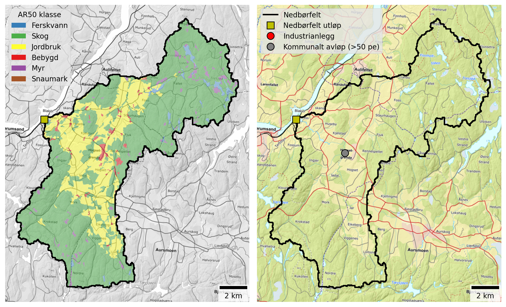

{#fig-aa width=500 fig-align="center"}

```{python}
#| label: tbl-aa-land-cover
#| tbl-cap: "Land cover proportions for Åa based on NIBIO's AR50 dataset."
#| echo: false

import pandas as pd

catch = "Åa"

# Read land cover data
df = pd.read_excel(r"./data/catchment_land_cover.xlsx")
df = df.set_index("klasse")

# Create total row
total = df.sum(numeric_only=True)
total.name = "Totalt"
df = pd.concat([df, total.to_frame().T])

# Convert to MultiIndex
new_cols = []
for col in df.columns:
    catchment, statistic = col.rsplit("_", 1)
    if statistic == "km2":
        statistic = "km²"
    elif statistic == "pct":
        statistic = "%"
    new_cols.append((catchment, statistic))
df.columns = pd.MultiIndex.from_tuples(new_cols, names=["Nedbørfelt", "AR50 klasse"])

# Select catchment
df = df[[catch]]

# Format
km2_cols = [c for c in df.columns if c[1] == "km²"]
pct_cols = [c for c in df.columns if c[1] == "%"]
for col in pct_cols:
    df[col] = df[col].round().astype(int)
fmt = {c: "{:.1f}" for c in km2_cols}

# Style
df.style.format(fmt).set_table_styles(
    [
        {"selector": "th.col_heading", "props": [("text-align", "center")]},
        {"selector": "th.col_heading.level0", "props": [("text-align", "center")]},
        {"selector": "th.col_heading.level1", "props": [("text-align", "center")]},
    ]
).map(lambda _: "font-weight: bold;", subset=pd.IndexSlice[["Totalt"], :])
```