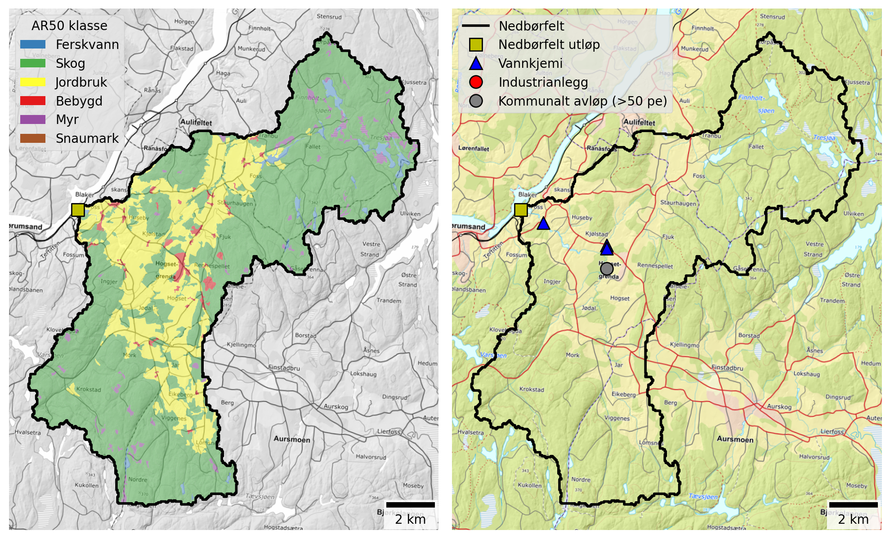

## Catchment overview {#sec-aa-overview}

Åa is a small catchment (131 km²) draining to Glomma in the eastern part of Lillestrøm kommune. Land cover is predominantly forest (72 %) and agriculture (23 %). See @fig-aa and @tbl-aa-land-cover. 58 % of the catchment is located below the marine limit and 26 % is underlain by marine clay deposits. The catchment is classified as *leirpåvirket* (clay-influenced) and the *Good/Moderate* threshold for TOTP is set to 50 μg-P/l (@fig-marine-clay and @tbl-leir-totp-bounds).

{#fig-aa width=800 fig-align="center"}

```{python}
#| label: tbl-aa-land-cover
#| tbl-cap: "Land cover proportions for Åa based on NIBIO's AR50 dataset."
#| echo: false

import pandas as pd

catch = "Åa"

# Read land cover data
df = pd.read_excel(r"./data/catchment_land_cover.xlsx")
df = df.set_index("klasse")

# Create total row
total = df.sum(numeric_only=True)
total.name = "Totalt"
df = pd.concat([df, total.to_frame().T])

# Convert to MultiIndex
new_cols = []
for col in df.columns:
    catchment, statistic = col.rsplit("_", 1)
    if statistic == "km2":
        statistic = "km²"
    elif statistic == "pct":
        statistic = "%"
    new_cols.append((catchment, statistic))
df.columns = pd.MultiIndex.from_tuples(new_cols, names=["Nedbørfelt", "AR50 klasse"])

# Select catchment
df = df[[catch]]

# Format
km2_cols = [c for c in df.columns if c[1] == "km²"]
pct_cols = [c for c in df.columns if c[1] == "%"]
for col in pct_cols:
    df[col] = df[col].round().astype(int)
fmt = {c: "{:.1f}" for c in km2_cols}

# Style
df.style.format(fmt).set_table_styles(
    [
        {"selector": "th.col_heading", "props": [("text-align", "center")]},
        {"selector": "th.col_heading.level0", "props": [("text-align", "center")]},
        {"selector": "th.col_heading.level1", "props": [("text-align", "center")]},
    ]
).map(lambda _: "font-weight: bold;", subset=pd.IndexSlice[["Totalt"], :])
```

There are no industrial discharges to Åa and the only municipal wastewater treatment plant reporting discharges within the modelling period is Hogset renseanlegg (@tbl-aa-pt-sources). However, this closed down in 2017 and the effluent is now handled by Midtre Romerike avløpsselskap (MIRA), which discharges directly to Glomma at Tangen, west of Sørumsand. 

```{python}
#| label: tbl-aa-pt-sources
#| tbl-cap: "Industrial and municipal wastewater discharges within the Åa catchment. Values are mean annual discharges from 2013 to 2024, excluding overflows."
#| echo: false

import pandas as pd

cat_list = ["Åa"]

# Read point source data
df = pd.read_excel(r"./data/point_discharges.xlsx", sheet_name="point_locs").query(
    "name in @cat_list"
)

# Convert to tonnes
pars = ["TOTN", "TOTP", "TOC", "SS"]
for par in pars:
    df[f"{par} (tonn)"] = df[f"{par}_kg"] / 1000

# Tidy
rename_dict = {
    "site_name": "Navn",
    "sector": "Sektor",
    "type": "Type",
}
df = df.rename(columns=rename_dict)
val_cols = [f"{par} (tonn)" for par in pars]
text_cols = list(rename_dict.values())
df = df[text_cols + val_cols]

# Format and style
fmt = {c: "{:.2f}" for c in val_cols}
df.style.format(fmt).hide(axis="index").set_properties(
    subset=text_cols, **{"text-align": "center"}
).set_table_styles(
    [{"selector": "th.col_heading", "props": [("text-align", "center")]}]
)
```

## Monitoring data {#sec-aa-monitoring}

The best monitoring data for Åa come from Vannmiljø station `002-60929` (Fossåa ved Sylta), which is part of waterbody `002-3685-R` (Fossåa). The site is located approximately 1 km upstream from the confluence with Glomma and has been monitored since 2003, although the sampling frequency during the early part of the record is low (5 to 10 samples per year). From 2017 onwards, monitoring has improved and the site has been sampled roughly 20 times per year. 

@fig-aa-ann-concs shows trends in mean annual concentrations estimated from the combined dataset for waterbody `002-3685-R` (Fossåa). There are no significant trends for any parameters, although the data quality for this waterbody is not as good as for other sites in this study, making robust trend identification difficult. TOTN concentrations have been broadly stable at around 1300 μg-N/l for much of the past decade, which is close to the boundary between *Poor* and *Moderate* status under the WFD. For TOTP, measured annual concentrations vary between 40 and 80 μg-P/l, and the waterbody is assigned *Moderate* status in Vann-Nett. TOC concentrations are typically around 14 mg-C/l, while SS concentrations vary considerably between 10 and 35 mg/l.


![Trends in annual mean concentrations for waterbody `002-3685-R` (Fossåa). Solid red lines show statistically significant linear trends ($p ≤ 0.05$); dashed red lines indicate weak evidence of a linear trend ($0.05 < p ≤ 0.10$); and dashed black lines indicate no statistically significant trend ($p > 0.10$). Background colours show thresholds for water quality status defined under the Water Framework Directive and taken from Vann-Nett, where available (*bad*, *poor*, *moderate*, *good* and *high*).](./plots/concs/ann_trends_waterbodies_002-3685-R.png){#fig-aa-ann-concs width=800 fig-align="center"}

## Source apportionment {#sec-aa-sources}

@fig-teotil3-aa shows nutrient fluxes for Åa estimated from observed data (black lines) together with source-apportioned fluxes simulated by TEOTIL3 (stacked bars). Note that the Åa catchment is represented as just a single, small REGINE unit in NVE's catchment dataset. For this reason, it is not well suited to modelling with TEOTIL3 and **results must be interpreted with caution** (@sec-spatial-res).

Fluxes simulated by TEOTIL3 are generally compatible with the highest values from the monitoring. Given the relatively low monitoring frequency, it is likely that load estimates based on monitoring underestimate true values, but it is also possible that TEOTIL3 is underestimating retention in this catchment (because TEOTIL3's retention calculations are not designed for single REGINEs). In addition, NIBIO's modelling of agricultural nutrient losses has high uncertainty at the scale of single REGINE units.

As expected from low frequency monitoring, the measured fluxes for Åa have high variability - especially for TOTP and SS. Based on the period from 2017 to 2024, typical annual nutrient fluxes for this catchment are:

 * 50 to 150 tonnes/year for TOTN
 * 2 to 10 tonnes/year for TOTP
 * 500 to 1300 tonnes/year for TOC
 * 1000 to 6000 tonnes/year for SS

{#fig-teotil3-aa width=800 fig-align="center"}

@fig-aa-src-app shows the mean contribution of each source to annual fluxes during the period 2020 to 2024. According to TEOTIL3, agriculture contributes 72 % of the TOTN load, 81 % of the TOTP load, and 94 % of the SS load, while forests (background) contribute 99 % of the TOC load. For all parameters, the dominant nutrient sources in this catchment are agriculture and forests, although wastewater discharges from spredt account for roughly 2 % of TOTN and 6 % of TOTP. Despite roughly half of the Åa catchment being located within Lillestrøm kommune, the rainwater and emergency overflows dataset from Lillestrøm suggests that inputs from overflows are negligible.

{#fig-aa-src-app width=800 fig-align="center"}

## Load reductions and scenarios {#sec-aa-avlast}

During the decade from 2015 to 2024, the median annual flow volume at Fossåa ved Sylta (Vannmiljø station `002-60929`) was 60 Mm³/year. Taking the maximum concentrations for GES of 775 μg/l for N and 50 μg/l for P, the maximum annual load for *Good* status in a typical year is approximately 47 tonnes for TOTN and 3 tonnes for TOTP. These values are roughly equivalent to the lowest values in the observed data, but for most years fluxes are considerably higher.

@fig-aa-avlast shows distributions of annual avlastningsbehov estimated for each year between 2015 and 2024. Red curves show distributions based on measured loads, while blue curves are based on model output from TEOTIL3, which must be interpreted with caution. Since annual loads simulated by TEOTIL3 are generally higher than those based on monitoring, avlastningsbehovene estimated using TEOTIL3 are also consistently higher. Given the limitations of both monitoring and modelling in this catchment, it is difficult to know which dataset is most representative. 

For TOTN, both distributions are narrow and pointed, with a median avlastningsbehov based on observations of 44 %, compared to 63 % using TEOTIL3. For TOTP, the distribution based on observed data is broad: annual estimates of avlastningsbehovene range from 0 % to 58 %, with a median of 19 %. Estimates from TEOTIL3 are consistently higher, with a median of 58 %. Which of these estimates is better depends on whether the low TOTP and SS fluxes measured during 2017-19 and 2022 (@fig-teotil3-aa) are accurate, or whether the sampling programme missed flow events that mobilised significant amounts of particulate phosphorus.

{#fig-aa-avlast width=800 fig-align="center"}

@fig-aa-scens shows load reductions achieved in the Åa catchment under two management scenarios modelled by [Wallhead *et al.* (2026)](https://www.miljodirektoratet.no/publikasjoner/2026/april-2026/modellering-av-oslofjorden-scenarier-med-redusert-menneskelig-belastning-for-a-oppna-god-okologisk-tilstand/). The scenarios comprise packages of agricultural mitigation measures together with upgrades to municipal wastewater treatment plants (@sec-teo-scens).

There are no municipal wastewater treatment plants within the Åa catchment large enough to be affected by the scenarios, so simulations do not show any reductions in wastewater inputs. Furthermore, analysis undertaken in this study using overflows data from Lillstrøm kommune indicates that rainwater and emergency overflows from Lillestrøm to this catchment are small. However, load reductions of approximately 2 % for TOTN and 6 % for TOTP could potentially be achieved by reducing inputs from spredt avløp (@sec-aa-sources).

Given the lack of point sources, the main scenario reductions in this catchment are achieved by agricultural measures. Scenario A achieves a roughly 1 % reduction in TOTN loads and a 39 % reduction in TOTP, while scenario B achieves 27 % for TOTN and 53 % for TOTP. Scenario A is therefore sufficient to achieve the estimated avlastningsbehov for TOTP, but even scenario B is insufficient for TOTN. Estimates avlastningsbehovene for TOTN of 44 to 63 % are high, which will make achieving GES for TOTN in this catchment difficult.

A summary of avlastningsbehovene for GES in Åa and the reductions achieved by scenarios A and B is shown in @tbl-scen_summary-aa.

. Black vertical lines on the plots for TOTN and TOTP show the median avlastningsbehov for GES estimated using observed data (@fig-aa-avlast). For clarity, labels are omitted from bars representing less than 3 %.](./plots/modelled/oslomod_scens_Åa.png){#fig-aa-scens width=800 fig-align="center"}

```{python}
#| label: tbl-scen_summary-aa
#| tbl-cap: "Summary of avlastningsbehov and scenario results for Åa."
#| echo: false

import pandas as pd

catch = "Åa"

# Read site data
xl_path = r"./data/scenario_summary.xlsx"
df = pd.read_excel(xl_path).query("`Nedbørfelt` == @catch")

wfd_col_dict = {
    "High": "#5893A9",
    "Good": "#6FB22C",
    "Moderate": "#FFF6A6",
    "Poor": "#F6A800",
    "Bad": "#E63D5C",
}


def color_wfd(val):
    color = wfd_col_dict.get(val)
    if not color:
        return ""

    text_color = "white" if val in ["Poor", "Bad"] else "black"
    return f"background-color: {color}; color: black;"


# Format
txt_cols = ["Nedbørfelt", "Vannforekomst ID", "Parameter", "Vann-Nett tilstand"]
num_cols = [c for c in df.columns if c not in txt_cols]
df[num_cols] = df[num_cols].round().astype("Int64")

# Style
(
    df.style.hide(axis="index")
    .format(na_rep="")
    .map(color_wfd, subset=["Vann-Nett tilstand"])
    .set_table_styles(
        [{"selector": "th.col_heading", "props": [("text-align", "center")]}]
    )
    .set_properties(subset=txt_cols, **{"text-align": "center"})
    .set_properties(subset=num_cols, **{"text-align": "right"})
)
```