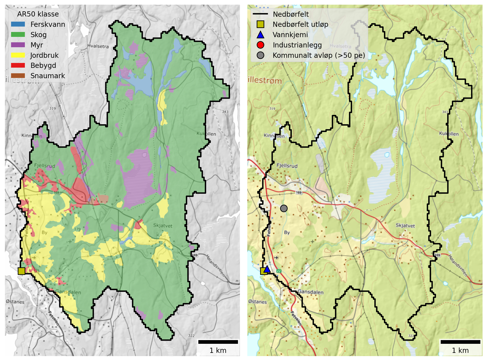

## Catchment overview {#sec-gansaa-overview}

Gansåa is a small catchment (25 km²) that drains to Gansvika on the eastern side of Øyeren. It is the only catchment included in this study that lies entirely within Lillestrøm kommune (@fig-catchments). Land cover is dominated by forest (73 %), although agricultural land is also important in the lower catchment (13 %), and extensive wetlands occupy parts of the central area (7 %). See @fig-gansaa and @tbl-gansaa-land-cover. Approximately 40 % of the catchment lies below the marine limit, and 19 % of the land area is underlain by marine deposits (@fig-marine-clay and @tbl-leir-totp-bounds). Although this proportion is higher than in several of the other catchments considered here, Gansåa is the only catchment not classified as *leirpåvirket* (clay-influenced). Instead, it is assigned to waterbody type `R108` (*Medium, moderately calcareous, humic*). For this waterbody type, the *Good/Moderate* boundary for TOTP is 29 μg-P/l.

{#fig-gansaa width=800 fig-align="center"}

```{python}
#| label: tbl-gansaa-land-cover
#| tbl-cap: "Land cover proportions for Gansåa based on NIBIO's AR50 dataset."
#| echo: false

import pandas as pd

catch = "Gansåa"

# Read land cover data
df = pd.read_excel(r"./data/catchment_land_cover.xlsx")
df = df.set_index("klasse")

# Create total row
total = df.sum(numeric_only=True)
total.name = "Totalt"
df = pd.concat([df, total.to_frame().T])

# Convert to MultiIndex
new_cols = []
for col in df.columns:
    catchment, statistic = col.rsplit("_", 1)
    if statistic == "km2":
        statistic = "km²"
    elif statistic == "pct":
        statistic = "%"
    new_cols.append((catchment, statistic))
df.columns = pd.MultiIndex.from_tuples(new_cols, names=["Nedbørfelt", "AR50 klasse"])

# Select catchment
df = df[[catch]]

# Format
km2_cols = [c for c in df.columns if c[1] == "km²"]
pct_cols = [c for c in df.columns if c[1] == "%"]
for col in pct_cols:
    df[col] = df[col].round().astype(int)
fmt = {c: "{:.1f}" for c in km2_cols}

# Style
df.style.format(fmt).set_table_styles(
    [
        {"selector": "th.col_heading", "props": [("text-align", "center")]},
        {"selector": "th.col_heading.level0", "props": [("text-align", "center")]},
        {"selector": "th.col_heading.level1", "props": [("text-align", "center")]},
    ]
).map(lambda _: "font-weight: bold;", subset=pd.IndexSlice[["Totalt"], :])
```

Gansåa receives discharges from Dalen renseanlegg, located in the western part of the catchment (@fig-gansaa). This is a small facility with chemical treatment type and a design capacity of 1000 p.e. (@tbl-gansaa-pt-sources). As of 2026, Dalen is being closed down and the effluent re-directed approximately 5 km westwards to Holtet, which lies outside the catchment boundary. From here, wastewater will be pumped northwards for processing at Midtre Romerike avløpsselskap (MIRA).

There are no industrial discharges within this catchment and wastewater overflows from Lillestrøm kommune are small. However, there are significant inputs from spredt avløp (@sec-gansaa-sources).

```{python}
#| label: tbl-gansaa-pt-sources
#| tbl-cap: "Industrial and municipal wastewater discharges within the Gansåa catchment. Values are mean annual discharges from 2013 to 2024, excluding overflows."
#| echo: false

import pandas as pd

cat_list = ["Gansåa"]

# Read point source data
df = pd.read_excel(r"./data/point_discharges.xlsx", sheet_name="point_locs").query(
    "name in @cat_list"
)

# Convert to tonnes
pars = ["TOTN", "TOTP", "TOC", "SS"]
for par in pars:
    df[f"{par} (tonn)"] = df[f"{par}_kg"] / 1000

# Tidy
rename_dict = {
    "site_name": "Navn",
    "sector": "Sektor",
    "type": "Type",
}
df = df.rename(columns=rename_dict)
val_cols = [f"{par} (tonn)" for par in pars]
text_cols = list(rename_dict.values())
df = df[text_cols + val_cols]

# Format and style
fmt = {c: "{:.2f}" for c in val_cols}
df.style.format(fmt).hide(axis="index").set_properties(
    subset=text_cols, **{"text-align": "center"}
).set_table_styles(
    [{"selector": "th.col_heading", "props": [("text-align", "center")]}]
)
```

## Monitoring data {#sec-gansaa-monitoring}

The best monitoring data for Gansåa come from Vannmiljø station `002-60933` (Gansåa nedstrøms Dalen RA), which is located approximately 200 m upstream of the outflow to Øyeren. The station is part of waterbody `002-3655-R` (Gansåa) and has been monitored since 2003, but data before 2017 are limited. Since 2017, data collection has been more frequent - typically 20 to 25 samples per year.

@fig-gansaa-ann-concs shows trends in mean annual concentrations estimated from the combined dataset for waterbody `002-3655-R`. There are no significant trends for any parameters, although the data period (10 years) is short for robust trend identification. TOTN concentrations are typically between 800 and 1000 μg-N/l, which corresponds to *Moderate* status under the Water Framework Directive. TOTP concentrations are also within the *Moderate* class, usually between 30 and 40 μg-P/l.

![Trends in annual mean concentrations for waterbody `002-3655-R` (Gansåa). Solid red lines show statistically significant linear trends ($p ≤ 0.05$); dashed red lines indicate weak evidence of a linear trend ($0.05 < p ≤ 0.10$); and dashed black lines indicate no statistically significant trend ($p > 0.10$). Background colours show thresholds for water quality status defined under the Water Framework Directive and taken from Vann-Nett, where available (*bad*, *poor*, *moderate*, *good* and *high*).](./plots/concs/ann_trends_waterbodies_002-3655-R.png){#fig-gansaa-ann-concs width=800 fig-align="center"}

## Source apportionment {#sec-gansaa-sources}

@fig-teotil3-gansaa shows nutrient fluxes for Gansåa estimated from observed data (black lines) together with source-apportioned fluxes simulated by TEOTIL3 (stacked bars). Because the Gansåa catchment is small (25 km²) and occupies only part of a single REGINE unit, it is not possible to simulate nutrient fluxes explicitly using TEOTIL3 (see @sec-spatial-res for details). TEOTIL3's estimates of diffuse nutrient fluxes for Gansåa are therefore based on simulations from a wider area, scaled to match the size of the Gansåa catchment. **TEOTIL3 results for Gansåa are therefore approximate and must be interpreted with caution**, since they assume average land management and point inputs for REGINE `002.C5`, rather than using Gansåa-specific data.

Based on available monitoring data, typical nutrient fluxes for Gansåa (waterbody `002-3655-R`) are approximately:

 * 10 to 20 tonnes/year for TOTN
 * 0.3 to 1.3 tonnes/year for TOTP
 * 100 to 300 tonnes/year for TOC
 * 100 to 700 tonnes/year for SS

{#fig-teotil3-gansaa width=800 fig-align="center"}

@fig-gansåa-src-app shows the mean contribution of each source to annual fluxes during the period 2020 to 2024. As noted above, source apportionment is based on data from a wider area (REGINE `002.C5`), so results are approximate. According to TEOTIL3, agriculture is the main source of TOTN, TOTP and SS inputs to REGINE `002.C5`, while background areas, predominantly forests and marshland, contribute most of the TOC. Background sources also make significant contributions to TOTN (40 %), TOTP (16 %) and SS (7 %). 

Wastewater inputs contribute approximately 10 % of the TOTN and TOTP to REGINE `002.C5`. For TOTN, this can be divided into 6.5 % from municipal wastewater discharges and 3.5 % from spredt avløp. For TOTP, the split is 1.5 % and 8.5 %, respectively. Note, however, that these figures likely underestimate the true contribution from municipal wastewater to the Gansåa catchment. This is because inputs from Dalen renseanlegg to Gansåa are proportionally greater than the average over REGINE `002.C5` as a whole.

{#fig-gansaa-src-app width=800 fig-align="center"}

## Load reductions and scenarios {#sec-gansaa-avlast}

During the decade from 2015 to 2024, the median annual flow volume at the outflow of Gansåa (Vannmiljø station `002-60933`) was 14 Mm³/year. Taking the maximum concentrations for GES of 775 μg/l for N and 29 μg/l for P, the maximum annual load for *Good* status in a typical year is approximately 11 tonnes for TOTN and 0.4 tonnes for TOTP (@fig-teotil3-gansaa). These values are roughly equivalent to the lowest estimates in the observed data, but measured fluxes are usually higher.

@fig-gansaa-avlast shows distributions of annual avlastningsbehov estimated for each year between 2015 and 2024. Red curves show distributions based on measured loads, while blue curves are based on model output from TEOTIL3 for REGINE `002.C5`, which must be interpreted with caution. Using the observed data, the median avlastningsbehov for TOTN is 24 %, and for TOTP it is 23 %. Estimates using TEOTIL3 are considerably higher (36 % and 58 %, respectively), but these are based on model results from a wider area, which are not considered robust at the scale of Gansåa.

{#fig-gansaa-avlast width=800 fig-align="center"}

@fig-gansaa-scens shows load reductions achieved in the Gansåa catchment under two management scenarios modelled by [Wallhead *et al.* (2026)](https://www.miljodirektoratet.no/publikasjoner/2026/april-2026/modellering-av-oslofjorden-scenarier-med-redusert-menneskelig-belastning-for-a-oppna-god-okologisk-tilstand/). As described above, the estimated reductions are derived from modelled changes across a larger area that includes the Gansåa catchment, rather than from measures implemented specifically within the catchment itself. The scenarios comprise packages of agricultural mitigation measures together with upgrades to municipal wastewater treatment plants (@sec-teo-scens).

Dale renseanlegg is too small to be affected by the wastewater upgrades considered by Wallhead *et al.*, so the scenarios do not show any changes in wastewater inputs. However, historically, Dalen renseanlegg discharges around 3 tonnes of TOTN and 30 kg of TOTP per year (@tbl-gansaa-pt-sources). From late 2026, these discharges will redirected out of the catchment to MIRA, which could lead to significant reductions in TOTN fluxes (up to 20 %), and more modest reductions in TOTP fluxes (around 3 %), in addition to the changes modelled by Wallhead *et al.* shown on @fig-gansaa-scens.

The agricultural measures modelled by NIBIO achieve load reductions for TOTN of 2 % under scenario A and 16 % in scenario B. For TOTP, the reductions are 45 % and 56 %, respectively. Neither scenario achieves the median avlastningsbehov of 24 % for TOTN, but once the effect of decommissioning Dalen renseanlegg in 2026 is included, it is likely that scenario B would achieve GES for TOTN, and scenario A would come close. For TOTP, the agricultural measures in scenarios A and B both comfortably exceed the median load reduction target of 23 %. Based on these results, it seems feasible that Gansåa will achieve GES for nitrogen and phosphorous in the coming years, as long as agricultural measures broadly equivalent to scenario A are implemented.

A summary of avlastningsbehovene for GES in Gansåa and the reductions achieved by scenarios A and B is shown in @tbl-scen_summary-gansaa.

. Black vertical lines on the plots for TOTN and TOTP show the median avlastningsbehov for GES estimated using observed data (@fig-gansaa-avlast). For clarity, labels are omitted from bars representing less than 3 %.](./plots/modelled/oslomod_scens_Gansåa.png){#fig-gansaa-scens width=800 fig-align="center"}

```{python}
#| label: tbl-scen_summary-gansaa
#| tbl-cap: "Summary of avlastningsbehov and scenario results for Gansåa. Model results are based on a wider area and are approximate at the scale of Gansåa (see text)."
#| echo: false

import pandas as pd

catch = "Gansåa"

# Read site data
xl_path = r"./data/scenario_summary.xlsx"
df = pd.read_excel(xl_path).query("`Nedbørfelt` == @catch")

wfd_col_dict = {
    "High": "#5893A9",
    "Good": "#6FB22C",
    "Moderate": "#FFF6A6",
    "Poor": "#F6A800",
    "Bad": "#E63D5C",
}


def color_wfd(val):
    color = wfd_col_dict.get(val)
    if not color:
        return ""

    text_color = "white" if val in ["Poor", "Bad"] else "black"
    return f"background-color: {color}; color: black;"


# Format
txt_cols = ["Nedbørfelt", "Vannforekomst ID", "Parameter", "Vann-Nett tilstand"]
num_cols = [c for c in df.columns if c not in txt_cols]
df[num_cols] = df[num_cols].round().astype("Int64")

# Style
(
    df.style.hide(axis="index")
    .format(na_rep="")
    .map(color_wfd, subset=["Vann-Nett tilstand"])
    .set_table_styles(
        [{"selector": "th.col_heading", "props": [("text-align", "center")]}]
    )
    .set_properties(subset=txt_cols, **{"text-align": "center"})
    .set_properties(subset=num_cols, **{"text-align": "right"})
)
```