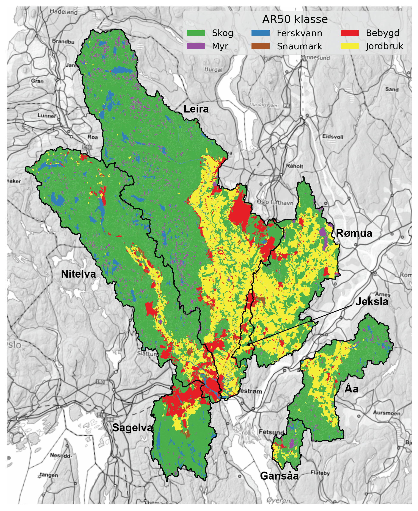

## Scope {#sec-scope}

This project aims to:

 * Summarise available monitoring data for catchments around Lillestrøm kommune.
   
 * Describe present-day water quality status and observed trends over time.

 * Use modelling to identify the main sources of nutrients in each catchment.

 * Describe the potential for reducing nutrient loads in each catchment using measures targeting wastewater and agriculture (based on recent modelling of the Oslofjord catchment undertaken by NIVA and NIBIO for Miljødirekotratet).

## Area of interest {#sec-aoi}

@tbl-catchments and @fig-catchments show the catchments of interest.

| Catchment ID |   Name  | Outlet lon | Outlet lat |                            Comment                           |
|:------------:|:-------:|:----------:|:----------:|:------------------------------------------------------------:|
|       1      | Sagelva |  11.02384  |  59.95745  |                     Tributary to Nitelva                     |
|       2      | Nitelva |  11.07092  |  59.93806  |            Just upstream of confluence with Leira            |
|       3      |  Leira  |  11.07367  |  59.93905  |           Just upstream of confluence with Nitelva           |
|       4      |  Rømua  |  11.20984  |  59.99055  |                    Single REGINE; no lakes                   |
|       5      |  Jeksla |  11.09281  |  59.99753  | Small sub-catchment of Leira; not resolved by REGINE network |
|       6      |    Åa   |  11.28279  |  59.99649  |                   Single REGINE; few lakes                   |
|       7      |  Gansåa |  11.22130  |  59.86080  |                Not resolved by REGINE network                |

: Catchments considered in this study. {#tbl-catchments .striped .hover}

{#fig-catchments width=600 fig-align="center"}

## Sources of nutrients {#sec-nut-sources}

### Diffuse sources {#sec-diff-sources}

@tbl-land-cover and @fig-land-cover show land cover proportions for each catchment.

 * Forest is the dominant land cover (≥65 %) for Leira, Nitelva, Sagelva, Åa and Gansåa.
   
 * Agriculture is the dominant land cover class for Rømua (49 %) and Jeksla (39 %), and also covers significant parts of Leira (20 %) and Åa (23 %).

 * Sagelva and Jeksla have significant urban areas (16 % and 23 %, respectively).

{#fig-land-cover width=600 fig-align="center"}

```{python}
#| label: tbl-land-cover
#| tbl-cap: "Land cover proportions based on NIBIO's AR50 dataset."
#| echo: false

import pandas as pd

# Read land cover data
df = pd.read_excel(r"./data/catchment_land_cover.xlsx")
df = df.set_index("klasse")

# Create total row
total = df.sum(numeric_only=True)
total.name = "Totalt"
df = pd.concat([df, total.to_frame().T])

# Convert to MultiIndex
new_cols = []
for col in df.columns:
    catchment, statistic = col.rsplit("_", 1)
    if statistic == "km2":
        statistic = "km²"
    elif statistic == "pct":
        statistic = "%"
    new_cols.append((catchment, statistic))
df.columns = pd.MultiIndex.from_tuples(new_cols, names=["Nedbørfelt", "AR50 klasse"])

# Reorder
order = ["Sagelva", "Nitelva", "Leira", "Rømua", "Jeksla", "Åa", "Gansåa"]
df = df[order]

# Format
km2_cols = [c for c in df.columns if c[1] == "km²"]
pct_cols = [c for c in df.columns if c[1] == "%"]
for col in pct_cols:
    df[col] = df[col].round().astype(int)
fmt = {c: "{:.1f}" for c in km2_cols}

# Style
df.style.format(fmt).set_table_styles(
    [
        {"selector": "th.col_heading", "props": [("text-align", "center")]},
        {"selector": "th.col_heading.level0", "props": [("text-align", "center")]},
        {"selector": "th.col_heading.level1", "props": [("text-align", "center")]},
    ]
).map(lambda _: "font-weight: bold;", subset=pd.IndexSlice[["Totalt"], :])
```

### Point sources {#sec-pt-sources}

Major point sources are shown in @tbl-pt-sources. Nutrient inputs are the mean of reported discharges during the period from 2013 to 2023 (in tonnes).

 * The largest single point source is **Nedre Romerike avløpsanlegg (NRA)**, which discharges to Nitelva just upstream of the confluence with Leira. Other significant wastewater discharges to Nitelva are renseanleggene at **Rotnes** and **Åneby**, further upstream. In Leira, significant wastewater discharges include **Gardermoen sentralrenseanlegg** and **Kløfta renseanlegg**, both in the lower-central part of the catchment.
   
 * The largest industrial point source is **Dynea Lillestrøm**, a manufacturer of adhesives and industrial coatings.

```{python}
#| label: tbl-pt-sources
#| tbl-cap: "Main point sources of nutrients within the study area."
#| echo: false

import pandas as pd

# Read point source data
df = pd.read_excel(r"./data/point_discharges.xlsx", sheet_name="point_locs")

# Convert to tonnes
pars = ["TOTN", "TOTP", "TOC", "SS"]
for par in pars:
    df[f"{par} (tonn)"] = df[f"{par}_kg"] / 1000

# Tidy
rename_dict = {
    "name": "Nedbørfelt",
    "site_name": "Navn",
    "sector": "Sektor",
    "type": "Type",
}
df = df.rename(columns=rename_dict)
val_cols = [f"{par} (tonn)" for par in pars]
text_cols = list(rename_dict.values())
df = df[text_cols + val_cols]

# Format and style
fmt = {c: "{:.2f}" for c in val_cols}
df.style.format(fmt).hide(axis="index").set_properties(
    subset=text_cols, **{"text-align": "center"}
).set_table_styles(
    [{"selector": "th.col_heading", "props": [("text-align", "center")]}]
)
```

