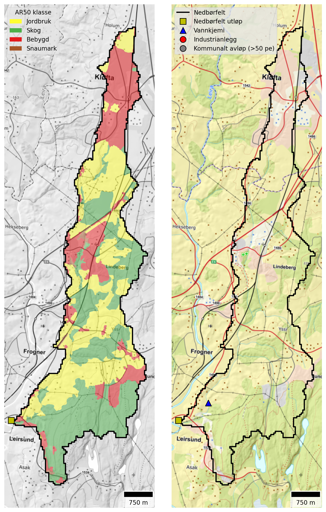

{#fig-jeksla width=500 fig-align="center"}

```{python}
#| label: tbl-jeksla-land-cover
#| tbl-cap: "Land cover proportions for Jeksla based on NIBIO's AR50 dataset."
#| echo: false

import pandas as pd

catch = "Jeksla"

# Read land cover data
df = pd.read_excel(r"./data/catchment_land_cover.xlsx")
df = df.set_index("klasse")

# Create total row
total = df.sum(numeric_only=True)
total.name = "Totalt"
df = pd.concat([df, total.to_frame().T])

# Convert to MultiIndex
new_cols = []
for col in df.columns:
    catchment, statistic = col.rsplit("_", 1)
    if statistic == "km2":
        statistic = "km²"
    elif statistic == "pct":
        statistic = "%"
    new_cols.append((catchment, statistic))
df.columns = pd.MultiIndex.from_tuples(new_cols, names=["Nedbørfelt", "AR50 klasse"])

# Select catchment
df = df[[catch]]

# Format
km2_cols = [c for c in df.columns if c[1] == "km²"]
pct_cols = [c for c in df.columns if c[1] == "%"]
for col in pct_cols:
    df[col] = df[col].round().astype(int)
fmt = {c: "{:.1f}" for c in km2_cols}

# Style
df.style.format(fmt).set_table_styles(
    [
        {"selector": "th.col_heading", "props": [("text-align", "center")]},
        {"selector": "th.col_heading.level0", "props": [("text-align", "center")]},
        {"selector": "th.col_heading.level1", "props": [("text-align", "center")]},
    ]
).map(lambda _: "font-weight: bold;", subset=pd.IndexSlice[["Totalt"], :])
```

## Monitoring data {#sec-jeksla-monitoring}

![Trends in annual mean concentrations for waterbody `002-599-R` (Jeksla). Solid red lines show statistically significant linear trends ($p ≤ 0.05$); dashed red lines indicate weak evidence of a linear trend ($0.05 < p ≤ 0.10$); and dashed black lines indicate no statistically significant trend ($p > 0.10$). Background colours show thresholds for water quality status defined under the Water Framework Directive and taken from Vann-Nett, where available (*bad*, *poor*, *moderate*, *good* and *high*).](./plots/concs/ann_trends_waterbodies_002-599-R.png){#fig-jeksla-ann-concs width=800 fig-align="center"}

## Source apportionment {#sec-jeksla-sources}

{#fig-teotil3-jeksla width=800 fig-align="center"}


{#fig-jeksla-src-app width=800 fig-align="center"}

## Load reductions and scenarios {#sec-jeksla-avlast}

{#fig-jeksla-avlast width=800 fig-align="center"}

. Black vertical lines on the plots for TOTN and TOTP show the median avlastningsbehov for GES estimated using observed data (@fig-jeksla-avlast).](./plots/modelled/oslomod_scens_Jeksla.png){#fig-jeksla-scens width=800 fig-align="center"}

```{python}
#| label: tbl-scen_summary-jeksla
#| tbl-cap: "Summary of avlastningsbehov and scenario results for Jeksla."
#| echo: false

import pandas as pd

catch = "Jeksla"

# Read site data
xl_path = r"./data/scenario_summary.xlsx"
df = pd.read_excel(xl_path).query("`Nedbørfelt` == @catch")

wfd_col_dict = {
    "High": "#5893A9",
    "Good": "#6FB22C",
    "Moderate": "#FFF6A6",
    "Poor": "#F6A800",
    "Bad": "#E63D5C",
}


def color_wfd(val):
    color = wfd_col_dict.get(val)
    if not color:
        return ""

    text_color = "white" if val in ["Poor", "Bad"] else "black"
    return f"background-color: {color}; color: black;"


# Format
txt_cols = ["Nedbørfelt", "Vannforekomst ID", "Parameter", "Vann-Nett tilstand"]
num_cols = [c for c in df.columns if c not in txt_cols]
df[num_cols] = df[num_cols].round().astype("Int64")

# Style
(
    df.style.hide(axis="index")
    .format(na_rep="")
    .map(color_wfd, subset=["Vann-Nett tilstand"])
    .set_table_styles(
        [{"selector": "th.col_heading", "props": [("text-align", "center")]}]
    )
    .set_properties(subset=txt_cols, **{"text-align": "center"})
    .set_properties(subset=num_cols, **{"text-align": "right"})
)
```