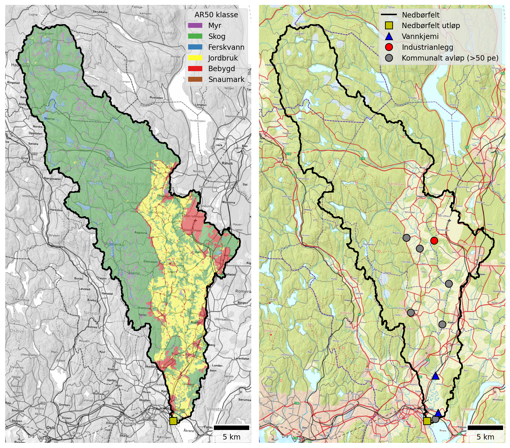

## Catchment overview {#sec-leira-overview}

Leira is the largest catchment considered in this study (668 km²) and includes Jeksla as a tributary. Land cover is dominated by forest (65 %), but the lower catchment is predominantly agricultural (20 %). See @fig-leira and @tbl-leira-land-cover. 36 % of the catchment is located below the marine limit and 26 % is underlain by clay-rich marine deposits, including most of the agricultural land. According to the Water Framework Directive, Leira is classified as *leirpåvirket* (clay-influenced) and the *Good/Moderate* threshold for TOTP is set to 50 μg-P/l, which is higher than e.g. Nitelva (@fig-marine-clay and @tbl-leir-totp-bounds).

{#fig-leira width=800 fig-align="center"}

```{python}
#| label: tbl-leira-land-cover
#| tbl-cap: "Land cover proportions for Leira based on NIBIO's AR50 dataset."
#| echo: false

import pandas as pd

catch = "Leira"

# Read land cover data
df = pd.read_excel(r"./data/catchment_land_cover.xlsx")
df = df.set_index("klasse")

# Create total row
total = df.sum(numeric_only=True)
total.name = "Totalt"
df = pd.concat([df, total.to_frame().T])

# Convert to MultiIndex
new_cols = []
for col in df.columns:
    catchment, statistic = col.rsplit("_", 1)
    if statistic == "km2":
        statistic = "km²"
    elif statistic == "pct":
        statistic = "%"
    new_cols.append((catchment, statistic))
df.columns = pd.MultiIndex.from_tuples(new_cols, names=["Nedbørfelt", "AR50 klasse"])

# Select catchment
df = df[[catch]]

# Format
km2_cols = [c for c in df.columns if c[1] == "km²"]
pct_cols = [c for c in df.columns if c[1] == "%"]
for col in pct_cols:
    df[col] = df[col].round().astype(int)
fmt = {c: "{:.1f}" for c in km2_cols}

# Style
df.style.format(fmt).set_table_styles(
    [
        {"selector": "th.col_heading", "props": [("text-align", "center")]},
        {"selector": "th.col_heading.level0", "props": [("text-align", "center")]},
        {"selector": "th.col_heading.level1", "props": [("text-align", "center")]},
    ]
).map(lambda _: "font-weight: bold;", subset=pd.IndexSlice[["Totalt"], :])
```

The main point source inputs to Leira are Gardermoen sentralrenseanlegg and Kløfta renseanlegg, both of which discharge to the river's main stem in the lower eastern part of the catchment. Gjerdrum renseanlegg was also a significant source of nutrients until 2017, when it was decommissioned (@tbl-leira-pt-sources).

Gardermoen sentralrenseanlegg is a chemical-biological treatment plant that includes nitrogen removal. It has been significantly upgraded in recent years and is now one of the country's most modern and efficient wastewater treatment plants. In this study, we use data reported by the wastewater sector between 2013 and 2024. Since the new plant at Gardermoen did not become operational until March 2025, the latest improvements are not fully reflected in the modelling presented here. However, even before 2025, treatment efficiencies reported by Gardermoen were high: the median TOTN efficiency between 2020 and 2024 was already 85 % (although for 2024 it dips as low as 64 %, perhaps linked to commissioning of the new plant).

Kløfta renseanlegg is an older chemically based treatment facility with relatively low nitrogen removal efficiency. Reported nitrogen removal rates between 2020 and 2024 ranged from 18 % to 24 %. As of 2026, the plant is being decommissioned and replaced by a pumping station that will convey wastewater to the upgraded treatment facility at Gardermoen. Once this work is complete, the vast majority of municipal wastewater discharges to Leira will be handled by a modern, high-performance facility with substantially improved nutrient removal efficiency.

```{python}
#| label: tbl-leira-pt-sources
#| tbl-cap: "Industrial and municipal wastewater discharges within the Leira catchment. Values are mean annual discharges from 2013 to 2024, excluding overflows."
#| echo: false

import pandas as pd

cat_list = ["Leira"]

# Read point source data
df = pd.read_excel(r"./data/point_discharges.xlsx", sheet_name="point_locs").query(
    "name in @cat_list"
)

# Convert to tonnes
pars = ["TOTN", "TOTP", "TOC", "SS"]
for par in pars:
    df[f"{par} (tonn)"] = df[f"{par}_kg"] / 1000

# Tidy
rename_dict = {
    "site_name": "Navn",
    "sector": "Sektor",
    "type": "Type",
}
df = df.rename(columns=rename_dict)
val_cols = [f"{par} (tonn)" for par in pars]
text_cols = list(rename_dict.values())
df = df[text_cols + val_cols]

# Format and style
fmt = {c: "{:.2f}" for c in val_cols}
df.style.format(fmt).hide(axis="index").set_properties(
    subset=text_cols, **{"text-align": "center"}
).set_table_styles(
    [{"selector": "th.col_heading", "props": [("text-align", "center")]}]
)
```

## Monitoring data {#sec-leira-monitoring}

The best monitoring data for the lower Leira come from Vannmiljø station `002-29659` (Leira ved Borgen bru), located near the catchment outflow, and station `002-30584` (Leira ved Leirsund), which is about 12 km upstream (but only 5 km in a straight line, because the lower Leira meanders). A further 4 km upstream is station `002-30575` (Frogner Leira), which also has excellent long-term monitoring. These stations are marked by blue triangles on @fig-leira.

The station at Leirsund has data from 1998 to 2008, making it useful for analysis of long-term trends, but not for understanding more recent changes. The stations at Borgen bru and Frogner have data from 1981 to the present. All three stations are assigned to waterbody `002-3384-R` (Leira nedstrøms Krokfoss).

@fig-leira-ann-concs shows trends in mean annual concentrations estimated from the combined dataset for waterbody `002-3384-R`. Concentrations of TOTN have remained consistently high over the past 40 years, close the the boundary between *Moderate* and *Poor* status. For TOTP, there is a significant declining trend in annual concentrations of about -1 μg-P/l/year, but values are still above the threshold for GES. TOC concentrations are significantly increasing (by +0.08 mg-C/l/year, on average), and concentrations of SS are broadly stable.

As with other catchments in this region, increasing TOC concentrations are partly driven by the increasing solubility of organic matter in forest and upland soils as catchments recover from acidification. This has led to “browning” of surface waters in many rivers and lakes, and also to “coastal darkening” in parts of Oslofjord and Skagerrak (e.g. [Frigstad *et al.*, 2023](https://www.sciencedirect.com/science/article/pii/S0272771422004516?via%3Dihub)).

![Trends in annual mean concentrations for waterbody `002-3384-R` (Leira nedstrøms Krokfoss). Solid red lines show statistically significant linear trends ($p ≤ 0.05$); dashed red lines indicate weak evidence of a linear trend ($0.05 < p ≤ 0.10$); and dashed black lines indicate no statistically significant trend ($p > 0.10$). Background colours show thresholds for water quality status defined under the Water Framework Directive and taken from Vann-Nett, where available (*bad*, *poor*, *moderate*, *good* and *high*).](./plots/concs/ann_trends_waterbodies_002-3384-R.png){#fig-leira-ann-concs width=800 fig-align="center"}

## Source apportionment {#sec-leira-sources}

@fig-teotil3-leira shows nutrient fluxes for Leira estimated from observed data (black lines) together with source-apportioned fluxes simulated by TEOTIL3 (stacked bars). Results from TEOTIL3 are broadly in agreement with the monitoring data for all parameters, although there is evidence that TEOTIL3 slightly overestimates fluxes of TOTN and TOC compared to the monitoring, and slightly underestimates fluxes of TOTP and SS. 

The monitoring records for TOTP and SS show high variability. This is as expected, since high loads of particulate material and TPP can be transported during a small number of short-duration flow events. Taken together, monitoring and modelling provide a consistent picture of nutrient loads transported by the lower Leira (waterbody `002-3384-R`):

 * 450 to 900 tonnes/year for TOTN
 * 25 to 100 tonnes/year for TOTP
 * 2500 to 5000 tonnes/year for TOC
 * 30 000 to 90 000 tonnes/year for SS

It is interesting to note that, despite being substantially larger, loads of TOTN and TOC transported by Leira are similar to those measured in Nitelva (@sec-nitelva-sources). However, loads of TOTP and SS in Leira are significantly higher, probably due to the greater proportion of clay-rich sediments in the lower part of the catchment (@fig-marine-clay and @tbl-marine-clay).

{#fig-teotil3-leira width=800 fig-align="center"}

@fig-nitelva-src-app shows the mean contribution of each source to annual fluxes during the period 2020 to 2024. According to TEOTIL3, agriculture is the dominant source of nutrients and suspended solids, accounting for 60 % of TOTN, 79 % of TOTP, and 91 % of SS. This reflects both the predominance of agricultural land use in the lower catchment (@fig-leira) and the fact that most municipal wastewater is treated at the Gardermoen treatment plant, which achieves high nutrient removal efficiencies. As with other catchments in this region, most of the TOC comes from forest soils in the upper catchment, which are included in the "background" category in TEOTIL3.

Wastewater discharges account for 13 % of the TOTN reaching waterbody `002-3384-R`: about 1 % from spredt avløp and the rest (12 %) from treated municipal wastewater discharges. Rainwater and emergency wastewater overflows do not make a significant contribution to the catchment scale nitrogen budget, but it is important to note that overflow data are only included for Lilestrøm kommune (@sec-lillestrom-data). It is likely that wastewater overflows would be more significant if data from the neighbouring Ullensaker and Nannestad kommuner were also included. For phosphorous, wastewater discharges account for an average of 5 % of the annual TOTP load: 3 % from municipal wastewater and 2 % from spredt avløp.

{#fig-leira-src-app width=800 fig-align="center"}

## Load reductions and scenarios {#sec-leira-avlast}

During the decade from 2015 to 2024, the median annual flow volume from Leira at Borgen bru (station `002-29659`) was 420 Mm³/year. Taking the maximum concentrations for GES of 775 μg/l for N and 50 μg/l for P, the maximum annual load for *Good* status in a typical year is approximately 326 tonnes for TOTN and 21 tonnes for TOTP. Monitored and modelled loads of TOTN and TOTP are consistently higher than this, indicating that significant load reductions are needed to achieve GES.

@fig-leira-avlast shows distributions of annual avlastningsbehov estimated for each year between 2015 and 2024. Red curves show distributions based on measured loads, while blue curves are based on model output from TEOTIL3. Since there is generally good agreement between measured and modelled fluxes, a consistent picture emerges for estimated avlastningsbehovene. For TOTN, the distributions are narrow, with a median avlastningsbehov based on observed data of 42 %, compared to 55 % from TEOTIL3. For TOTP, estimates of avlastningsbehovene based on monitoring and modelling are almost identical (54 % and 55 %, respectively), but the distributions are broader. This reflects greater interannual variability in mobilisation and transport of particulate P, which in turn leads to greater uncertainty in annual avlastningsbehovene. 

{#fig-leira-avlast width=800 fig-align="center"}

@fig-leira-scens shows load reductions achieved for the Leira catchment by two scenarios modelled by [Wallhead *et al.* (2026)](https://www.miljodirektoratet.no/publikasjoner/2026/april-2026/modellering-av-oslofjorden-scenarier-med-redusert-menneskelig-belastning-for-a-oppna-god-okologisk-tilstand/). These scenarios considered packages of agricultural measures and upgrades to larger municipal wastewater treatment plants (@sec-teo-scens). 

Under scenario A, plants with capacity greater than 10 000 p.e. were upgraded to achieve a nitrogen treatment efficiency of 80 %. Within the Leira catchment, the only treatment plants large enough to be affected are Gardermoen and Kløfta. Wallhead *et al.* used a baseline period of 2017 to 2019, during which Gardermoen reported a mean treatment efficiency for TOTN of 78 %, compared to 16 % for Kløfta. Upgrading these to achieve 80 % treatment efficiency reduces nitrogen inputs from municipal wastewater discharges by about 33 tonnes/year in scenario A, which corresponds to a load reduction of about 4 % to the lower Leira (waterbody `002-3384-R`). In scenario B, Gjerdum renseanlegg is also upgraded, which achieves an additional 1 % reduction in the annual TOTN load at the catchment outflow.

As of 2026, upgrades to the wastewater system that are broadly consistent with scenario B have already been implemented or surpassed in the Leira catchment. Gjerdum renseanlegg closed down in 2017 and Kløfta is in the process of being decommissioned. Most municipal wastewater discharges within Leira are now directed to the new treatment plant at Gardermoen, which frequently reports nitrogen treatment efficiencies above 85 % (i.e. better than assumed in scenario B). The wastewater reductions to TOTN loads from scenario B shown on @fig-leira-scens have therefore already been achieved - or exceeded - in the Leira catchment.

As shown on @fig-leira-src-app, agriculture is the main source of TOTN, TOTP and SS reaching the lower Leira. NIBIO's modelling suggests that agricultural measures in scenario A have only a small effect on TOTN losses, but a bigger effect on TOTP and SS. In scenario B, agricultural measures reduce the TOTN flux by 18 % and achieve a 52 % reduction in TOTP. Taken together, wastewater and agricultural measures yield a reduction in TOTN loads of approximately 25 % (around 5 % of which is already achieved by Gardermoen renseanlegg). However, this is not enough to reach the estimated avlastningsbehov for GES for nitrogen of 42 % (black dashed line on @fig-leira-scens). For phosphorous, agricultural measures achieve a TOTP load reduction of 52 %, which is approximately equal to avlastningsbehovene estimated from monitoring and modelling.

A summary of avlastningsbehovene for GES in Leira and the reductions achieved by scenarios A and B is shown in @tbl-scen_summary-leira.

. Black vertical lines on the plots for TOTN and TOTP show the median avlastningsbehov for GES estimated using observed data (@fig-leira-avlast).](./plots/modelled/oslomod_scens_Leira.png){#fig-leira-scens width=800 fig-align="center"}

```{python}
#| label: tbl-scen_summary-leira
#| tbl-cap: "Summary of avlastningsbehov and scenario results for Leira."
#| echo: false

import pandas as pd

catch = "Leira"

# Read site data
xl_path = r"./data/scenario_summary.xlsx"
df = pd.read_excel(xl_path).query("`Nedbørfelt` == @catch")

wfd_col_dict = {
    "High": "#5893A9",
    "Good": "#6FB22C",
    "Moderate": "#FFF6A6",
    "Poor": "#F6A800",
    "Bad": "#E63D5C",
}


def color_wfd(val):
    color = wfd_col_dict.get(val)
    if not color:
        return ""

    text_color = "white" if val in ["Poor", "Bad"] else "black"
    return f"background-color: {color}; color: black;"


# Format
txt_cols = ["Nedbørfelt", "Vannforekomst ID", "Parameter", "Vann-Nett tilstand"]
num_cols = [c for c in df.columns if c not in txt_cols]
df[num_cols] = df[num_cols].round().astype("Int64")

# Style
(
    df.style.hide(axis="index")
    .format(na_rep="")
    .map(color_wfd, subset=["Vann-Nett tilstand"])
    .set_table_styles(
        [{"selector": "th.col_heading", "props": [("text-align", "center")]}]
    )
    .set_properties(subset=txt_cols, **{"text-align": "center"})
    .set_properties(subset=num_cols, **{"text-align": "right"})
)
```