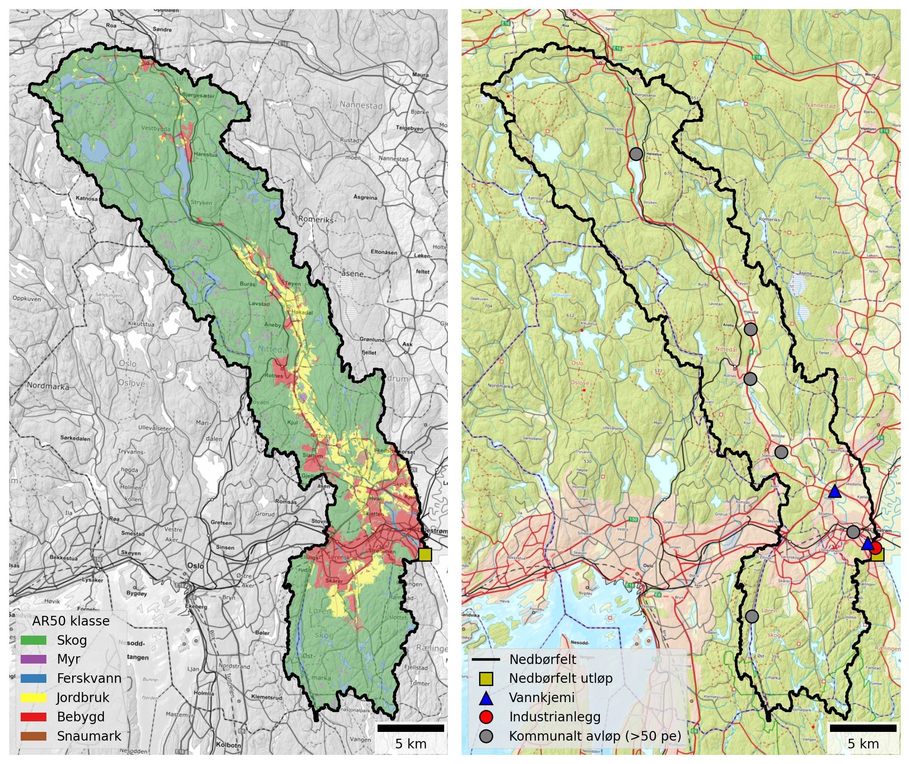

Nitelva is a medium sized catchment (484 km²) that includes Sagelva as a tributary. Land cover is dominated by forest (75 %), but there are significant areas of urban and agricultural land located along the river valley and in the lower part of the catchment. See @fig-nitelva and @tbl-nitelva-land-cover. 25 % of the catchment in located below the marine limit and approximately 13 % of the land area - including most agricultural land - is underlain by marine deposits. For this reason, the catchment is classified as *leirpåvirket* (clay-influenced) under the Water Framework Directive (@tbl-leir-totp-bounds). 

{#fig-nitelva width=800 fig-align="center"}

```{python}
#| label: tbl-nitelva-land-cover
#| tbl-cap: "Land cover proportions for Nitelva (including Sagelva) based on NIBIO's AR50 dataset."
#| echo: false

import pandas as pd

catch = "Nitelva"

# Read land cover data
df = pd.read_excel(r"./data/catchment_land_cover.xlsx")
df = df.set_index("klasse")

# Create total row
total = df.sum(numeric_only=True)
total.name = "Totalt"
df = pd.concat([df, total.to_frame().T])

# Convert to MultiIndex
new_cols = []
for col in df.columns:
    catchment, statistic = col.rsplit("_", 1)
    if statistic == "km2":
        statistic = "km²"
    elif statistic == "pct":
        statistic = "%"
    new_cols.append((catchment, statistic))
df.columns = pd.MultiIndex.from_tuples(new_cols, names=["Nedbørfelt", "AR50 klasse"])

# Select catchment
df = df[[catch]]

# Format
km2_cols = [c for c in df.columns if c[1] == "km²"]
pct_cols = [c for c in df.columns if c[1] == "%"]
for col in pct_cols:
    df[col] = df[col].round().astype(int)
fmt = {c: "{:.1f}" for c in km2_cols}

# Style
df.style.format(fmt).set_table_styles(
    [
        {"selector": "th.col_heading", "props": [("text-align", "center")]},
        {"selector": "th.col_heading.level0", "props": [("text-align", "center")]},
        {"selector": "th.col_heading.level1", "props": [("text-align", "center")]},
    ]
).map(lambda _: "font-weight: bold;", subset=pd.IndexSlice[["Totalt"], :])
```

Nitelva receives discharges from several municipal wastewater treatment plants, the largest of which is Nedre Romerike avløpsanlegg (NRA), located just upstream of the catchment outflow. A little further upstream there is also a decommissioned treatment plant at Slattum, which was operational until 2019. In the middle part of the catchment there are treatment plants at Rotnes and Åneby, and in the upper catchment is Harestua renseanlegg, which discharges to the northern end of Harestuvatnet. The catchment also receives significant nutrient inputs from Dynea Lillestrøm, a manufacturer of adhesives and industrial coatings that discharges close to the catchment outflow (@fig-nitelva and @tbl-nitelva-pt-sources).

Note that, as of 2026, the wastewater treatment plants at Rotnes and Åneby are being decommissioned and replaced. However, since the modelling in this report uses data up to 2024, both plants are considered "active" in this analysis.

```{python}
#| label: tbl-nitelva-pt-sources
#| tbl-cap: "Industrial and municipal wastewater discharges within the Nitelva catchment. Values are mean annual discharges from 2013 to 2024, excluding overflows."
#| echo: false

import pandas as pd

cat_list = ["Sagelva", "Nitelva"]

# Read point source data
df = pd.read_excel(r"./data/point_discharges.xlsx", sheet_name="point_locs").query(
    "name in @cat_list"
)

# Convert to tonnes
pars = ["TOTN", "TOTP", "TOC", "SS"]
for par in pars:
    df[f"{par} (tonn)"] = df[f"{par}_kg"] / 1000

# Tidy
rename_dict = {
    "site_name": "Navn",
    "sector": "Sektor",
    "type": "Type",
}
df = df.rename(columns=rename_dict)
val_cols = [f"{par} (tonn)" for par in pars]
text_cols = list(rename_dict.values())
df = df[text_cols + val_cols]

# Format and style
fmt = {c: "{:.2f}" for c in val_cols}
df.style.format(fmt).hide(axis="index").set_properties(
    subset=text_cols, **{"text-align": "center"}
).set_table_styles(
    [{"selector": "th.col_heading", "props": [("text-align", "center")]}]
)
```

## Monitoring data {#sec-nitelva-monitoring}

The best monitoring data for the Lower Nitelva (waterbody ID `002-3891-R`) come from Vannmiljø station `002-30586` (Rud Nitelva), which has been monitored since the 1980s. Monitoring at this station stopped at the end of 2020, after which the best data come from station `002-79092` (Nitelva, Rud), located about 300 m upstream. The monitoring dataset for this waterbody is generally of good quality, except during 2021 and 2022, when the sampling frequency is low. About 5 km further upstream, Vannmiljø station `002-30578` (Kjellerholen Nitelva) also provides long-term data for waterbody `002-1638-R` (Nitelva Slattum-Kjeller), beginning in 1995.

@fig-nitelva-ann-concs shows trends in mean annual concentrations estimated from the combined dataset for waterbody `002-3891-R`. Since the 1980s, there have been significant decreases in concentrations of TOTN (-37 μg-N/l/year on average), TOTP (-1 μg-P/l/year) and SS (-0.25 mg/l/year). There is also an increasing trend in concentrations of TOC (by an average of +0.03 mg-C/l/year). 

Declining trends in TOTN concentrations and increasing trends in TOC are also observed in Sagelva (@fig-sagelva-ann-concs) and for waterbody `002-1638-R` (Nitelva Slattum-Kjeller; see [here](https://github.com/NIVANorge/teotil3_lillestrom/blob/main/plots/concs/ann_trends_waterbodies_002-1638-R.png)), both of which are only a short distance upstream of Nedre Nitelva (waterbody `002-3891-R`). However, decreasing trends in TOTP and SS concentrations are not observed at these locations, which implies reductions in TOTP and SS inputs may have occurred primarily along the Nitelva main stem, between waterbodies `002-1638-R` and `002-3891-R` (i.e. between the two blue triangles on @fig-nitelva).

The increasing trend in TOC concentrations identified in several Nitelva subcatchments is consistent with patterns in TOC observed elsewhere in South-eastern Norway. These changes are at least partly driven by the increasing solubility of organic matter in forest and upland soils as catchments recover from acidification. This has led to "browning" of surface waters in many rivers and lakes previously affected by acidification, and also to "coastal darkening" in parts of Oslofjord and Skagerrak (e.g. [Frigstad *et al.*, 2023](https://www.sciencedirect.com/science/article/pii/S0272771422004516?via%3Dihub)).

In terms of water quality status, recent annual concentrations of TOTN in the Lower Nitelva are typically towards the middle of the *Moderate* status band, which is an improvement compared to consistently *Poor* status during the decade prior to 2020. For TOTP, concentrations have generally been below 40 μg-P/l (the upper threshold for *Good* status) since the early 2000s. However, in recent years, measured TOTP concentrations have been close to the *Good/Moderate* boundary and in Vann-Nett the waterbody is currently [assigned *Moderate* status for TOTP](https://vann-nett.no/waterbodies/002-3891-R/factsheet/environmental-status).

![Trends in annual mean concentrations for waterbody `002-3891-R` (Nedre Nitelva). Solid red lines show statistically significant linear trends ($p ≤ 0.05$); dashed red lines indicate weak evidence of a linear trend ($0.05 < p ≤ 0.10$); and dashed black lines indicate no statistically significant trend ($p > 0.10$). Background colours show thresholds for water quality status defined under the Water Framework Directive and taken from Vann-Nett, where available (*bad*, *poor*, *moderate*, *good* and *high*).](./plots/concs/ann_trends_waterbodies_002-3891-R.png){#fig-nitelva-ann-concs width=800 fig-align="center"}

## Source apportionment {#sec-nitelva-sources}

@fig-teotil3-nitelva shows nutrient fluxes for Nitelva estimated from observed data (black lines) together with source-apportioned fluxes simulated by TEOTIL3 (stacked bars). TEOTIL3’s simulations for TOTN and TOC are consistent with the monitoring data. For TOTP and SS, TEOTIL3's simulated fluxes are higher than the monitored fluxes until 2020, when observed fluxes increase sharply. From 2020 onwards, TEOTIL's simulations are broadly compatible with fluxes estimated from monitoring data.   

As noted in @sec-nitelva-monitoring, data from 2020 onwards come predominantly from Vannmiljø station station `002-79092` (Nitelva, Rud), whereas before 2020 most data come from a different site (`002-30586`; Rud Nitelva). Changes to the monitoring programme are therefore the most likely explanation for the sudden increase in measured fluxes, illustrating the large uncertainties in particulate nutrient loads estimated from low frequency sampling (see @sec-ann-loads). Another possible explanation is that a landslide occurred in Nittedal in autumn 2019, causing damage to the sewerage network and leading to increased wastewater discharges, as well as unusually high loads of phosphorus-rich clay particles. However, while this may explain the high measured loads of TOTP and SS in 2020, it cannot explain why loads remain high in 2023 and 2024 compared to pre-2019 levels.

Before 2019, measured fluxes of TOTP based on data from `002-30586` (Rud Nitelva) are typically 8 to 10 tonnes per year (@fig-teotil3-nitelva). This seems surprisingly low given that (i) measured TOTP fluxes from Sagelva are 2 to 4 tonnes per year (@fig-teotil3-sagelva); (ii) recent TOTP fluxes measured at Kjellerholen (Vannmiljø station `002-30578`), approximately 5 km upstream, vary between 7 and 22 tonnes/year (see [here](https://github.com/NIVANorge/teotil3_lillestrom/blob/main/plots/loads/all_stations_ann_loads.png)), and (iii) reported TOTP discharges from NRA, less than a kilometre upstream, are typically around 5 tonnes/year (@tbl-nitelva-pt-sources). Overall, it seems possible that measured fluxes for TOTP and SS between 2013 to 2018, as shown on @fig-teotil3-nitelva, might underestimate the true flux. This could be because station `002-30586` (Rud Nitelva) is located at Tangerudvika, where Nitelva becomes suddenly wider. At this point, it is likely that the river slows and stream power decreases, making it more difficult for conventional water sampling to accurately represent fluxes of particulate material.

Combining the available datasets, typical nutrient fluxes for Nedre Nitelva (waterbody `002-3891-R`) are approximately:

 * 400 to 800 tonnes/year for TOTN
 * 10 to 40 tonnes/year for TOTP
 * 2500 to 4000 tonnes/year for TOC
 * 3000 to 12000 tonnes/year for SS

As described in @sec-ann-loads, uncertainties are expected to be especially large for TOTP and SS.

{#fig-teotil3-nitelva width=800 fig-align="center"}


{#fig-nitelva-src-app width=800 fig-align="center"}

## Load reductions and scenarios {#sec-nitelva-avlast}

{#fig-nitelva-avlast width=800 fig-align="center"}

. Black vertical lines on the plots for TOTN and TOTP show the median avlastningsbehov for GES estimated using observed data (@fig-nitelva-avlast).](./plots/modelled/oslomod_scens_Nitelva.png){#fig-nitelva-scens width=800 fig-align="center"}

```{python}
#| label: tbl-scen_summary-nitelva
#| tbl-cap: "Summary of avlastningsbehov and scenario results for Nitelva."
#| echo: false

import pandas as pd

catch = "Nitelva"

# Read site data
xl_path = r"./data/scenario_summary.xlsx"
df = pd.read_excel(xl_path).query("`Nedbørfelt` == @catch")

wfd_col_dict = {
    "High": "#5893A9",
    "Good": "#6FB22C",
    "Moderate": "#FFF6A6",
    "Poor": "#F6A800",
    "Bad": "#E63D5C",
}


def color_wfd(val):
    color = wfd_col_dict.get(val)
    if not color:
        return ""

    text_color = "white" if val in ["Poor", "Bad"] else "black"
    return f"background-color: {color}; color: black;"


# Format
txt_cols = ["Nedbørfelt", "Vannforekomst ID", "Parameter", "Vann-Nett tilstand"]
num_cols = [c for c in df.columns if c not in txt_cols]
df[num_cols] = df[num_cols].round().astype("Int64")

# Style
(
    df.style.hide(axis="index")
    .format(na_rep="")
    .map(color_wfd, subset=["Vann-Nett tilstand"])
    .set_table_styles(
        [{"selector": "th.col_heading", "props": [("text-align", "center")]}]
    )
    .set_properties(subset=txt_cols, **{"text-align": "center"})
    .set_properties(subset=num_cols, **{"text-align": "right"})
)
```