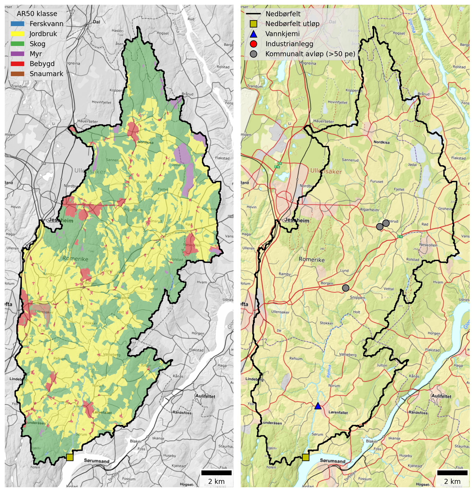

## Catchment overview {#sec-romua-overview}

Rømua is a small catchment (212 km²) draining to Glomma in the northern part of Lillestrøm kommune. Land cover is dominated by agriculture (49 %) and forest (44 %). See @fig-romua and @tbl-romua-land-cover. 84 % of the catchment is located below the marine limit and 53 % is underlain by marine clay deposits. The catchment is classified as *leirpåvirket* (clay-influenced) and the *Good/Moderate* threshold for TOTP is set to 80 μg-P/l (@fig-marine-clay and @tbl-leir-totp-bounds).

{#fig-romua width=800 fig-align="center"}

```{python}
#| label: tbl-romua-land-cover
#| tbl-cap: "Land cover proportions for Rømua based on NIBIO's AR50 dataset."
#| echo: false

import pandas as pd

catch = "Rømua"

# Read land cover data
df = pd.read_excel(r"./data/catchment_land_cover.xlsx")
df = df.set_index("klasse")

# Create total row
total = df.sum(numeric_only=True)
total.name = "Totalt"
df = pd.concat([df, total.to_frame().T])

# Convert to MultiIndex
new_cols = []
for col in df.columns:
    catchment, statistic = col.rsplit("_", 1)
    if statistic == "km2":
        statistic = "km²"
    elif statistic == "pct":
        statistic = "%"
    new_cols.append((catchment, statistic))
df.columns = pd.MultiIndex.from_tuples(new_cols, names=["Nedbørfelt", "AR50 klasse"])

# Select catchment
df = df[[catch]]

# Format
km2_cols = [c for c in df.columns if c[1] == "km²"]
pct_cols = [c for c in df.columns if c[1] == "%"]
for col in pct_cols:
    df[col] = df[col].round().astype(int)
fmt = {c: "{:.1f}" for c in km2_cols}

# Style
df.style.format(fmt).set_table_styles(
    [
        {"selector": "th.col_heading", "props": [("text-align", "center")]},
        {"selector": "th.col_heading.level0", "props": [("text-align", "center")]},
        {"selector": "th.col_heading.level1", "props": [("text-align", "center")]},
    ]
).map(lambda _: "font-weight: bold;", subset=pd.IndexSlice[["Totalt"], :])
```

Rømua receives discharges from three small wastewater plants connected to the municipal network (@tbl-romua-pt-sources). All three are located in the central part of the catchment (@fig-romua) and typical annual nutrient discharges are small. There are no industrial discharges within the catchment and contributions from spredt avløp and wastewater overflows (from Lillestrøm kommune) are low.

```{python}
#| label: tbl-romua-pt-sources
#| tbl-cap: "Industrial and municipal wastewater discharges within the Rømua catchment. Values are mean annual discharges from 2013 to 2024, excluding overflows."
#| echo: false

import pandas as pd

cat_list = ["Rømua"]

# Read point source data
df = pd.read_excel(r"./data/point_discharges.xlsx", sheet_name="point_locs").query(
    "name in @cat_list"
)

# Convert to tonnes
pars = ["TOTN", "TOTP", "TOC", "SS"]
for par in pars:
    df[f"{par} (tonn)"] = df[f"{par}_kg"] / 1000

# Tidy
rename_dict = {
    "site_name": "Navn",
    "sector": "Sektor",
    "type": "Type",
}
df = df.rename(columns=rename_dict)
val_cols = [f"{par} (tonn)" for par in pars]
text_cols = list(rename_dict.values())
df = df[text_cols + val_cols]

# Format and style
fmt = {c: "{:.2f}" for c in val_cols}
df.style.format(fmt).hide(axis="index").set_properties(
    subset=text_cols, **{"text-align": "center"}
).set_table_styles(
    [{"selector": "th.col_heading", "props": [("text-align", "center")]}]
)
```

## Monitoring data {#sec-romua-monitoring}

The best monitoring data for Rømua come from Vannmiljø station `002-28960` (Rømua ved Lørenfallet), which is located approximately 4 km upstream from the confluence with Glomma. The site has been monitored since 1990.

@fig-romua-ann-concs shows trends in mean annual concentrations estimated from the combined dataset for waterbody `002-3659-R` (Rømua). Concentrations of TOTN have been above 2000 μg-N/l for much of the past 30 years. However, there is a significant declining trend in TOTN (by -19 μg-N/l/year) and, since 2020, typical concentrations have been between 1500 and 2000 μg-N/l, corresponding to *Poor* status under the WFD. There are no significant trends for TOTP, and mean annual concentrations are typically between 75 and 175 μg-P/l. In Vann-Nett the water quality status for TOTP is classified as *Poor* (although the threshold between *Moderate* and *Poor* is not specified). SS concentrations are broadly stable and there is an increasing trend in TOC (in common with most other catchments in this region).

![Trends in annual mean concentrations for waterbody `002-3659-R` (Rømua). Solid red lines show statistically significant linear trends ($p ≤ 0.05$); dashed red lines indicate weak evidence of a linear trend ($0.05 < p ≤ 0.10$); and dashed black lines indicate no statistically significant trend ($p > 0.10$). Background colours show thresholds for water quality status defined under the Water Framework Directive and taken from Vann-Nett, where available (*bad*, *poor*, *moderate*, *good* and *high*).](./plots/concs/ann_trends_waterbodies_002-3659-R.png){#fig-romua-ann-concs width=800 fig-align="center"}

## Source apportionment {#sec-romua-sources}

@fig-teotil3-romua shows nutrient fluxes for Rømua estimated from observed data (black lines) together with source-apportioned fluxes simulated by TEOTIL3 (stacked bars). Note that even though the Rømua catchment is quite large (212 km²), it is represented by just a single REGINE unit in NVE's catchment dataset. For this reason, it is not well suited to modelling with TEOTIL3 and **results must be interpreted with caution** (@sec-spatial-res). 

Monitored fluxes for Rømua show high variability, especially for TOTP and SS. This is as expected for a catchment dominated by phosphorus-rich clay soils and monitored at relatively low sampling frequency: because these constituents are transported predominantly during high-flow events, estimates derived from monitoring are sensitive to the timing of sample collection relative to floods (@sec-ann-loads). While the TEOTIL3 simulations are also uncertain, modelled fluxes are broadly compatible with those estimated from observed data.

Based on @fig-teotil3-romua, typical annual nutrient fluxes for Rømua (waterbody `002-3659-R`) are:

 * 200 to 500 tonnes/year for TOTN
 * 5 to 30 tonnes/year for TOTP
 * 1000 to 2000 tonnes/year for TOC
 * 5000 to 20 000 tonnes/year for SS

{#fig-teotil3-romua width=800 fig-align="center"}

@fig-romua-src-app shows the mean contribution of each source to annual fluxes during the period 2020 to 2024. According to TEOTIL3, agriculture contributes 84 % of the TOTN load, 91 % of the TOTP load, and 95 % of the SS load, while forests (background) contribute 95 % of the TOC load. These estimates seem plausible given the lack of significant point sources and the fact that roughly half the catchment comprises agricultural land underlain by phosphorous-rich clays. Wastewater inputs from spredt avløp are estimated to be small, contributing about 1 % of TOTP and 0.5 % of TOTN, while wastewater overflows from within Lillestrøm kommune are negligible.

{#fig-romua-src-app width=800 fig-align="center"}

## Load reductions and scenarios {#sec-romua-avlast}

During the decade from 2015 to 2024, the median annual flow volume at Rømua ved Lørenfallet (Vannmiljø station `002-28960`) was 93 Mm³/year. Taking the maximum concentrations for GES of 775 μg/l for N and 80 μg/l for P, the maximum annual load for *Good* status in a typical year is approximately 72 tonnes for TOTN and 7 tonnes for TOTP. Annual TOTN loads are often higher than this by a factor of 4 to 5, and TOTP loads by a factor of 2 to 3. This indicates that significant reductions will be required to reach GES.

@fig-romua-avlast shows distributions of annual avlastningsbehov estimated for each year between 2015 and 2024. Red curves show distributions based on measured loads, while blue curves are based on model output from TEOTIL3, which must be interpreted with caution. Distributions for TOTN are generally narrow and pointed, with estimates from both monitoring and modelling in the range from 60 % and 80 %. For TOTP, the distributions are broader, indicating greater uncertainty in the annual estimates due to interannual variability. The median avlastningsbehov for TOTP based on monitoring is 46 %, compared to 58 % from TEOTIL3.

{#fig-romua-avlast width=800 fig-align="center"}

@fig-romua-scens shows load reductions achieved in the Rømua catchment under two management scenarios modelled by [Wallhead *et al.* (2026)](https://www.miljodirektoratet.no/publikasjoner/2026/april-2026/modellering-av-oslofjorden-scenarier-med-redusert-menneskelig-belastning-for-a-oppna-god-okologisk-tilstand/). The scenarios comprise packages of agricultural mitigation measures together with upgrades to municipal wastewater treatment plants (@sec-teo-scens).

The three municipal wastewater treatment plants in the Rømua catchment (@tbl-romua-pt-sources) are not large enough to be affected the scenarios of Wallhead *et al.*, so the simulations do not show any reductions in wastewater inputs in this catchment. Furthermore, historic data from Lillestrøm kommune indicate that wastewater inputs from rainwater and emergency overflows are small. However, reductions of up to 1 % could potentially be achieved by reducing inputs from spredt (@sec-romua-sources).

Since the Rømua catchment is intensively farmed, the biggest potential to reduce nutrient fluxes comes from agricultural measures. Modelling undertaken by NIBIO shows that scenario A achieves only a 2 % reduction in catchment scale TOTN loads, but a 48 % reduction in TOTP. Under scenario B, nitrogen and phosphorous loads are reduced by 30 % and 64 %, respectively.

Scenarios A and B both achieve the estimated avlastningsbehov of 46 % for TOTP (based on observed data). However, neither scenario comes close to the reduction target of 60 to 80 % for TOTN. Despite the significant decreasing trend in TOTN (@fig-romua-ann-concs), high measured TOTN concentrations and the limited potential for load reductions at point sources make it unlikely that Rømua will achieve GES for TOTN.

A summary of avlastningsbehovene for GES in Rømua and the reductions achieved by scenarios A and B is shown in @tbl-scen_summary-romua.

. Black vertical lines on the plots for TOTN and TOTP show the median avlastningsbehov for GES estimated using observed data (@fig-romua-avlast).](./plots/modelled/oslomod_scens_Rømua.png){#fig-romua-scens width=800 fig-align="center"}

```{python}
#| label: tbl-scen_summary-romua
#| tbl-cap: "Summary of avlastningsbehov and scenario results for Rømua."
#| echo: false

import pandas as pd

catch = "Rømua"

# Read site data
xl_path = r"./data/scenario_summary.xlsx"
df = pd.read_excel(xl_path).query("`Nedbørfelt` == @catch")

wfd_col_dict = {
    "High": "#5893A9",
    "Good": "#6FB22C",
    "Moderate": "#FFF6A6",
    "Poor": "#F6A800",
    "Bad": "#E63D5C",
}


def color_wfd(val):
    color = wfd_col_dict.get(val)
    if not color:
        return ""

    text_color = "white" if val in ["Poor", "Bad"] else "black"
    return f"background-color: {color}; color: black;"


# Format
txt_cols = ["Nedbørfelt", "Vannforekomst ID", "Parameter", "Vann-Nett tilstand"]
num_cols = [c for c in df.columns if c not in txt_cols]
df[num_cols] = df[num_cols].round().astype("Int64")

# Style
(
    df.style.hide(axis="index")
    .format(na_rep="")
    .map(color_wfd, subset=["Vann-Nett tilstand"])
    .set_table_styles(
        [{"selector": "th.col_heading", "props": [("text-align", "center")]}]
    )
    .set_properties(subset=txt_cols, **{"text-align": "center"})
    .set_properties(subset=num_cols, **{"text-align": "right"})
)
```