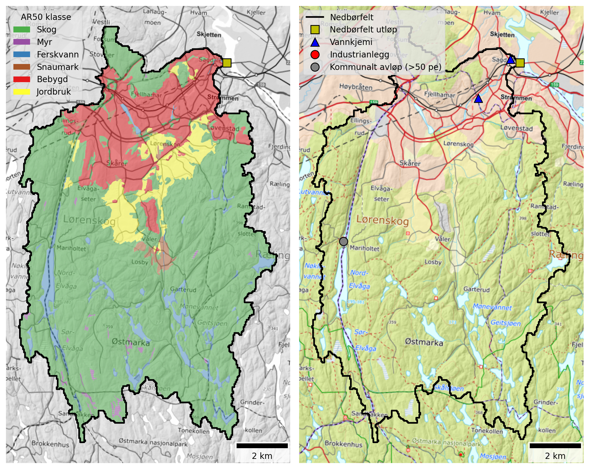

## Catchment overview {#sec-overview}

Sagelva is a small catchment (109 km²) draining to Nitelva in the western part of Lillestrøm kommune. Land cover is dominated by forest (71 %), but with significant urban (16 %) and agricultural (6 %) areas. See @fig-sagelva and @tbl-sagelva-land-cover.

{#fig-sagelva width=800 fig-align="center"}

```{python}
#| label: tbl-sagelva-land-cover
#| tbl-cap: "Land cover proportions for Sagelva based on NIBIO's AR50 dataset."
#| echo: false

import pandas as pd

catch = "Sagelva"

# Read land cover data
df = pd.read_excel(r"./data/catchment_land_cover.xlsx")
df = df.set_index("klasse")

# Create total row
total = df.sum(numeric_only=True)
total.name = "Totalt"
df = pd.concat([df, total.to_frame().T])

# Convert to MultiIndex
new_cols = []
for col in df.columns:
    catchment, statistic = col.rsplit("_", 1)
    if statistic == "km2":
        statistic = "km²"
    elif statistic == "pct":
        statistic = "%"
    new_cols.append((catchment, statistic))
df.columns = pd.MultiIndex.from_tuples(new_cols, names=["Nedbørfelt", "AR50 klasse"])

# Select catchment
df = df[[catch]]

# Format
km2_cols = [c for c in df.columns if c[1] == "km²"]
pct_cols = [c for c in df.columns if c[1] == "%"]
for col in pct_cols:
    df[col] = df[col].round().astype(int)
fmt = {c: "{:.1f}" for c in km2_cols}

# Style
df.style.format(fmt).set_table_styles(
    [
        {"selector": "th.col_heading", "props": [("text-align", "center")]},
        {"selector": "th.col_heading.level0", "props": [("text-align", "center")]},
        {"selector": "th.col_heading.level1", "props": [("text-align", "center")]},
    ]
).map(lambda _: "font-weight: bold;", subset=pd.IndexSlice[["Totalt"], :])
```

There are no major industrial discharges within the Sagelva catchment and the only municipal wastewater plant with design capacity ≥50 p.e. is Mariholtet sportsstue, which reports low discharges of nutrients (@tbl-sagelva-pt-sources).

```{python}
#| label: tbl-sagelva-pt-sources
#| tbl-cap: "Main point sources of nutrients within the study area."
#| echo: false

import pandas as pd

cat_list = ["Sagelva"]

# Read point source data
df = pd.read_excel(r"./data/point_discharges.xlsx", sheet_name="point_locs").query(
    "name in @cat_list"
)

# Convert to tonnes
pars = ["TOTN", "TOTP", "TOC", "SS"]
for par in pars:
    df[f"{par} (tonn)"] = df[f"{par}_kg"] / 1000

# Tidy
rename_dict = {
    "site_name": "Navn",
    "sector": "Sektor",
    "type": "Type",
}
df = df.rename(columns=rename_dict)
val_cols = [f"{par} (tonn)" for par in pars]
text_cols = list(rename_dict.values())
df = df[text_cols + val_cols]

# Format and style
fmt = {c: "{:.2f}" for c in val_cols}
df.style.format(fmt).hide(axis="index").set_properties(
    subset=text_cols, **{"text-align": "center"}
).set_table_styles(
    [{"selector": "th.col_heading", "props": [("text-align", "center")]}]
)
```

## Monitoring data {#sec-sagelva-monitoring}

The best monitoring data for Sagelva come from Vannmiljø stations `002-46599` (Sagelva ved Skjetten bro, F3) and `002-63540` (Fjellhammarelva, F10), both of which are part of waterbody `002-3899-R` (Fjellhamarelva - Sagelva; @fig-sagelva). Skjetten bro is the downstream-most station with the longest monitoring record, beginning in 1995. 

@fig-sagelva-ann-concs shows trends in mean annual concentrations estimated from the data for waterbody `002-3899-R`. Concentrations of SS and TOTP have remained broadly stable over the past 30 years, but there is evidence for a significant decline in TOTN concentrations (by about -8 μg-N/l/year) and a significant increase in TOC concentrations (by approximately +0.1 mg-C/l/year). For TOC, there appears to be a step-change increase in concentrations between 2012 and 2013. This may be due to changes in water sampling or analysis protocols, although in Vannmiljø the reporting lab has not changed.

{#fig-sagelva-ann-concs width=800 fig-align="center"}
